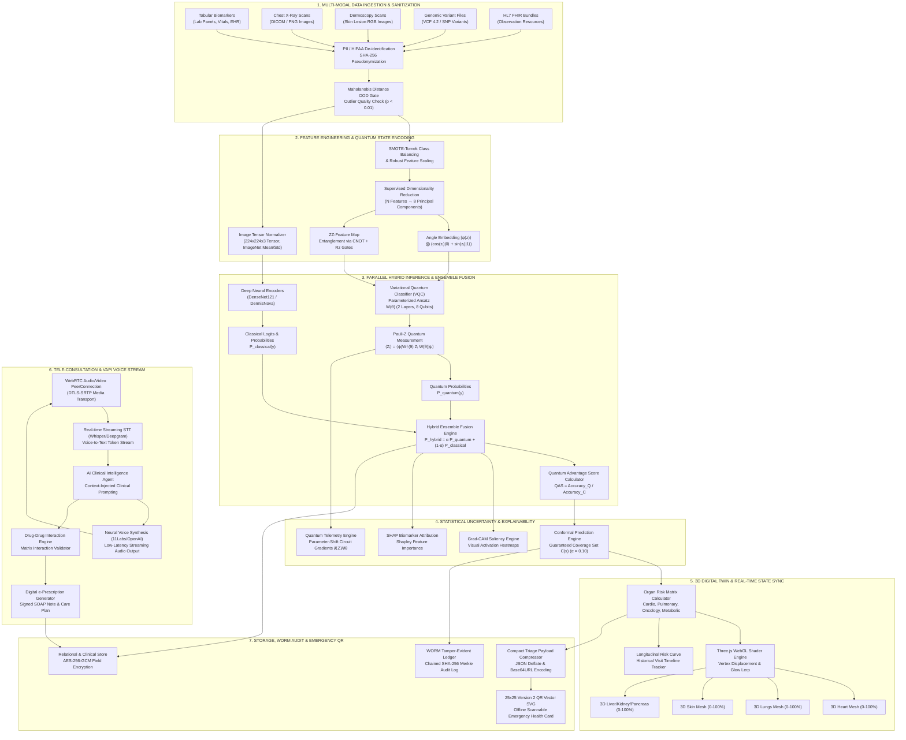
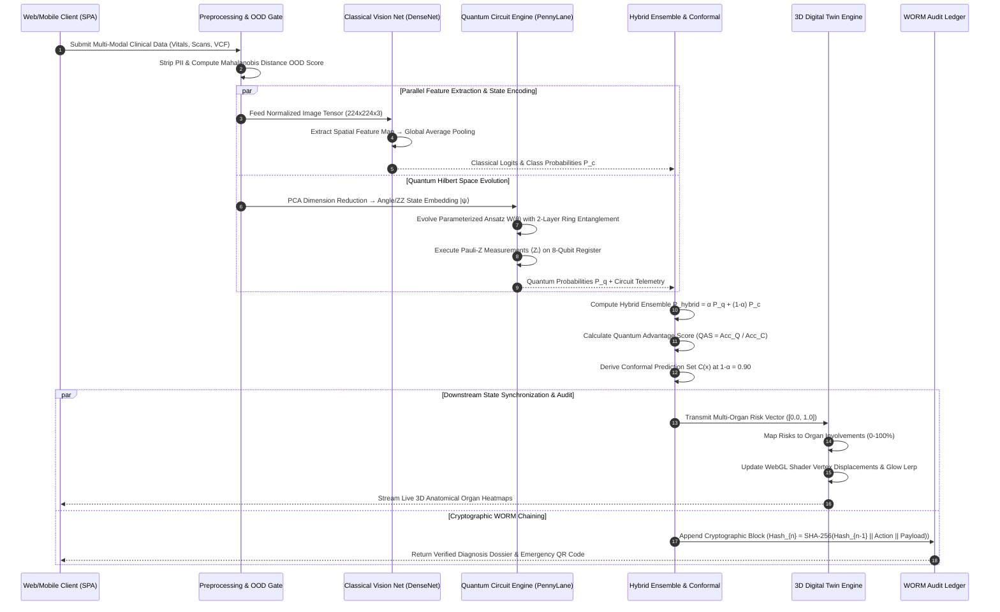
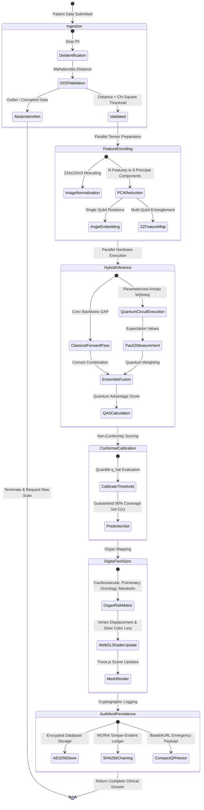

```mermaid
graph TD
    %% =========================================================================
    %% 1. MULTI-MODAL DATA INGESTION & QUALITY GATE
    %% =========================================================================
    subgraph S1["1. MULTI-MODAL DATA INGESTION & SANITIZATION"]
        direction TB
        RAW_EHR["Tabular Biomarkers<br/>(Lab Panels, Vitals, EHR)"]
        RAW_DICOM["Chest X-Ray Scans<br/>(DICOM / PNG Images)"]
        RAW_DERM["Dermoscopy Scans<br/>(Skin Lesion RGB Images)"]
        RAW_VCF["Genomic Variant Files<br/>(VCF 4.2 / SNP Variants)"]
        RAW_FHIR["HL7 FHIR Bundles<br/>(Observation Resources)"]

        ANON["PII / HIPAA De-identification<br/>SHA-256 Pseudonymization"]
        MAHALANOBIS["Mahalanobis Distance OOD Gate<br/>Outlier Quality Check (p < 0.01)"]

        RAW_EHR --> ANON
        RAW_DICOM --> ANON
        RAW_DERM --> ANON
        RAW_VCF --> ANON
        RAW_FHIR --> ANON

        ANON --> MAHALANOBIS
    end

    %% =========================================================================
    %% 2. PREPROCESSING & ENCODING PIPELINE
    %% =========================================================================
    subgraph S2["2. FEATURE ENGINEERING & QUANTUM STATE ENCODING"]
        direction TB
        SMOTE["SMOTE-Tomek Class Balancing<br/>& Robust Feature Scaling"]
        IMG_NORM["Image Tensor Normalizer<br/>(224x224x3 Tensor, ImageNet Mean/Std)"]
        PCA["Supervised Dimensionality Reduction<br/>(N Features → 8 Principal Components)"]
        
        Q_ANGLE["Angle Embedding |ψ(z)⟩<br/>⨂ (cos(zᵢ)|0⟩ + sin(zᵢ)|1⟩)"]
        Q_ZZ["ZZ-Feature Map<br/>Entanglement via CNOT + Rz Gates"]

        MAHALANOBIS --> SMOTE
        MAHALANOBIS --> IMG_NORM
        SMOTE --> PCA
        PCA --> Q_ANGLE
        PCA --> Q_ZZ
    end

    %% =========================================================================
    %% 3. HYBRID QUANTUM-CLASSICAL INFERENCE ENGINE
    %% =========================================================================
    subgraph S3["3. PARALLEL HYBRID INFERENCE & ENSEMBLE FUSION"]
        direction TB
        CONV_NET["Deep Neural Encoders<br/>(DenseNet121 / DermisNova)"]
        CLASSICAL_LOGITS["Classical Logits & Probabilities<br/>P_classical(y)"]

        VQC_CIRCUIT["Variational Quantum Classifier (VQC)<br/>Parameterized Ansatz W(θ) (2 Layers, 8 Qubits)"]
        MEASURE["Pauli-Z Quantum Measurement<br/>⟨Zᵢ⟩ = ⟨ψ|W†(θ) Zᵢ W(θ)|ψ⟩"]
        QUANTUM_LOGITS["Quantum Probabilities<br/>P_quantum(y)"]

        FUSION["Hybrid Ensemble Fusion Engine<br/>P_hybrid = α P_quantum + (1-α) P_classical"]
        QAS_CALC["Quantum Advantage Score Calculator<br/>QAS = Accuracy_Q / Accuracy_C"]

        IMG_NORM --> CONV_NET
        CONV_NET --> CLASSICAL_LOGITS

        Q_ANGLE --> VQC_CIRCUIT
        Q_ZZ --> VQC_CIRCUIT
        VQC_CIRCUIT --> MEASURE
        MEASURE --> QUANTUM_LOGITS

        CLASSICAL_LOGITS --> FUSION
        QUANTUM_LOGITS --> FUSION
        FUSION --> QAS_CALC
    end

    %% =========================================================================
    %% 4. UNCERTAINTY QUANTIFICATION & MULTI-MODAL EXPLAINABILITY
    %% =========================================================================
    subgraph S4["4. STATISTICAL UNCERTAINTY & EXPLAINABILITY"]
        direction TB
        CONFORMAL["Conformal Prediction Engine<br/>Guaranteed Coverage Set C(x) (α = 0.10)"]
        GRADCAM["Grad-CAM Saliency Engine<br/>Visual Activation Heatmaps"]
        SHAP["SHAP Biomarker Attribution<br/>Shapley Feature Importance"]
        Q_TELEMETRY["Quantum Telemetry Engine<br/>Parameter-Shift Circuit Gradients ∂⟨Z⟩/∂θ"]

        QAS_CALC --> CONFORMAL
        FUSION --> GRADCAM
        FUSION --> SHAP
        MEASURE --> Q_TELEMETRY
    end

    %% =========================================================================
    %% 5. 3D DIGITAL TWIN SYNCHRONIZATION
    %% =========================================================================
    subgraph S5["5. 3D DIGITAL TWIN & REAL-TIME STATE SYNC"]
        direction TB
        ORGAN_MAP["Organ Risk Matrix Calculator<br/>Cardio, Pulmonary, Oncology, Metabolic"]
        SHADER_ENGINE["Three.js WebGL Shader Engine<br/>Vertex Displacement & Glow Lerp"]
        MESH_HEART["3D Heart Mesh (0-100%)"]
        MESH_LUNGS["3D Lungs Mesh (0-100%)"]
        MESH_SKIN["3D Skin Mesh (0-100%)"]
        MESH_ORGANS["3D Liver/Kidney/Pancreas (0-100%)"]
        TIMELINE["Longitudinal Risk Curve<br/>Historical Visit Timeline Tracker"]

        CONFORMAL --> ORGAN_MAP
        ORGAN_MAP --> SHADER_ENGINE
        SHADER_ENGINE --> MESH_HEART
        SHADER_ENGINE --> MESH_LUNGS
        SHADER_ENGINE --> MESH_SKIN
        SHADER_ENGINE --> MESH_ORGANS
        ORGAN_MAP --> TIMELINE
    end

    %% =========================================================================
    %% 6. REAL-TIME TELE-CONSULTATION & VOICE AI STREAM
    %% =========================================================================
    subgraph S6["6. TELE-CONSULTATION & VAPI VOICE STREAM"]
        direction TB
        WEBRTC["WebRTC Audio/Video PeerConnection<br/>(DTLS-SRTP Media Transport)"]
        STT["Real-time Streaming STT (Whisper/Deepgram)<br/>Voice-to-Text Token Stream"]
        AI_DOC["AI Clinical Intelligence Agent<br/>Context-Injected Clinical Prompting"]
        TTS["Neural Voice Synthesis (11Labs/OpenAI)<br/>Low-Latency Streaming Audio Output"]
        DDI["Drug-Drug Interaction Engine<br/>Matrix Interaction Validator"]
        EPrescription["Digital e-Prescription Generator<br/>Signed SOAP Note & Care Plan"]

        WEBRTC --> STT
        STT --> AI_DOC
        AI_DOC --> TTS
        TTS --> WEBRTC
        AI_DOC --> DDI
        DDI --> EPrescription
    end

    %% =========================================================================
    %% 7. PERSISTENCE, WORM AUDIT & EMERGENCY QR CODE
    %% =========================================================================
    subgraph S7["7. STORAGE, WORM AUDIT & EMERGENCY QR"]
        direction TB
        DB_STORE["Relational & Clinical Store<br/>AES-256-GCM Field Encryption"]
        WORM["WORM Tamper-Evident Ledger<br/>Chained SHA-256 Merkle Audit Log"]
        QR_COMPRESS["Compact Triage Payload Compressor<br/>JSON Deflate & Base64URL Encoding"]
        QR_SVG["25x25 Version 2 QR Vector SVG<br/>Offline Scannable Emergency Health Card"]

        FUSION --> DB_STORE
        CONFORMAL --> WORM
        EPrescription --> DB_STORE
        ORGAN_MAP --> QR_COMPRESS
        QR_COMPRESS --> QR_SVG
    end
```

```mermaid
sequenceDiagram
    autonumber
    participant Client as Web/Mobile Client (SPA)
    participant Preproc as Preprocessing & OOD Gate
    participant Classical as Classical Vision Net (DenseNet)
    participant Quantum as Quantum Circuit Engine (PennyLane)
    participant Fusion as Hybrid Ensemble & Conformal
    participant Twin as 3D Digital Twin Engine
    participant Ledger as WORM Audit Ledger

    Client->>Preproc: Submit Multi-Modal Clinical Data (Vitals, Scans, VCF)
    Preproc->>Preproc: Strip PII & Compute Mahalanobis Distance OOD Score
    
    par Parallel Feature Extraction & State Encoding
        Preproc->>Classical: Feed Normalized Image Tensor (224x224x3)
        Classical->>Classical: Extract Spatial Feature Map → Global Average Pooling
        Classical-->>Fusion: Classical Logits & Class Probabilities P_c
    and Quantum Hilbert Space Evolution
        Preproc->>Quantum: PCA Dimension Reduction → Angle/ZZ State Embedding |ψ⟩
        Quantum->>Quantum: Evolve Parameterized Ansatz W(θ) with 2-Layer Ring Entanglement
        Quantum->>Quantum: Execute Pauli-Z Measurements ⟨Zᵢ⟩ on 8-Qubit Register
        Quantum-->>Fusion: Quantum Probabilities P_q + Circuit Telemetry
    end

    Fusion->>Fusion: Compute Hybrid Ensemble P_hybrid = α P_q + (1-α) P_c
    Fusion->>Fusion: Calculate Quantum Advantage Score (QAS = Acc_Q / Acc_C)
    Fusion->>Fusion: Derive Conformal Prediction Set C(x) at 1-α = 0.90
    
    par Downstream State Synchronization & Audit
        Fusion->>Twin: Transmit Multi-Organ Risk Vector ([0.0, 1.0])
        Twin->>Twin: Map Risks to Organ Involvements (0-100%)
        Twin->>Twin: Update WebGL Shader Vertex Displacements & Glow Lerp
        Twin-->>Client: Stream Live 3D Anatomical Organ Heatmaps
    and Cryptographic WORM Chaining
        Fusion->>Ledger: Append Cryptographic Block (Hash_{n} = SHA-256(Hash_{n-1} || Action || Payload))
        Ledger-->>Client: Return Verified Diagnosis Dossier & Emergency QR Code
    end
```

```mermaid
stateDiagram-v2
    [*] --> Ingestion : Patient Data Submitted
    
    state Ingestion {
        [*] --> DeIdentification : Strip PII
        DeIdentification --> OODValidation : Mahalanobis Distance
        OODValidation --> Validated : Distance < Chi-Square Threshold
        OODValidation --> AbstentionAlert : Outlier / Corrupted Data
    }
    
    AbstentionAlert --> [*] : Terminate & Request New Scan
    
    Validated --> FeatureEncoding : Parallel Tensor Preparation
    
    state FeatureEncoding {
        [*] --> ImageNormalization : 224x224x3 Rescaling
        [*] --> PCAReduction : N Features to 8 Principal Components
        PCAReduction --> AngleEmbedding : Single Qubit Rotations
        PCAReduction --> ZZFeatureMap : Multi-Qubit Entanglement
    }
    
    FeatureEncoding --> HybridInference : Parallel Hardware Execution
    
    state HybridInference {
        [*] --> ClassicalForwardPass : Conv Backbone GAP
        [*] --> QuantumCircuitExecution : Parameterized Ansatz W(theta)
        QuantumCircuitExecution --> PauliZMeasurement : Expectation Values
        ClassicalForwardPass --> EnsembleFusion : Convex Combination
        PauliZMeasurement --> EnsembleFusion : Quantum Weighting
        EnsembleFusion --> QASCalculation : Quantum Advantage Score
    }
    
    HybridInference --> ConformalCalibration : Non-Conformity Scoring
    
    state ConformalCalibration {
        [*] --> CalibrateThreshold : Quantile q_hat Evaluation
        CalibrateThreshold --> PredictionSet : Guaranteed 90% Coverage Set C(x)
    }
    
    ConformalCalibration --> DigitalTwinSync : Organ Mapping
    
    state DigitalTwinSync {
        [*] --> OrganRiskMatrix : Cardiovascular, Pulmonary, Oncology, Metabolic
        OrganRiskMatrix --> WebGLShaderUpdate : Vertex Displacement & Glow Color Lerp
        WebGLShaderUpdate --> MeshRender : Three.js Scene Updates
    }
    
    DigitalTwinSync --> AuditAndPersistence : Cryptographic Logging
    
    state AuditAndPersistence {
        [*] --> AES256Store : Encrypted Database Storage
        [*] --> SHA256Chaining : WORM Tamper-Evident Ledger
        [*] --> CompactQRVector : Base64URL Emergency Payload
    }
    
    AuditAndPersistence --> [*] : Return Complete Clinical Dossier
```
