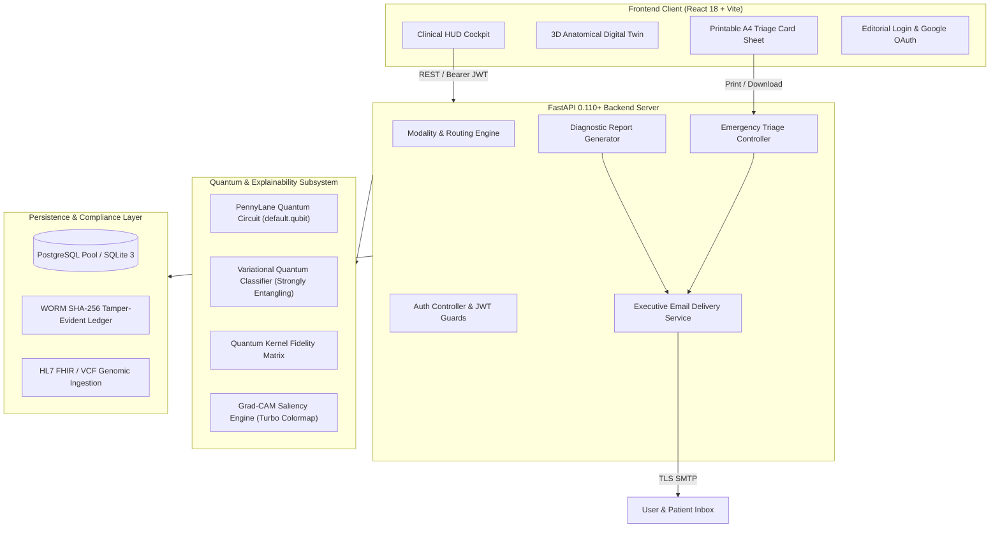

# Q-RAKSHAK: Quantum-Enhanced Clinical Intelligence Platform

[]()
[]()
[]()
[]()
[]()
[]()
[]()
[]()

> **Smart India Hackathon (SIH) Problem Statement ID 26139**  
> *Theme:* MedTech / BioTech / Quantum Computing in Healthcare  
> *Platform:* Q-RAKSHAK Quantum Clinical Operating System

---

## Table of Contents

1. [Executive Overview](#executive-overview)
2. [System Architecture](#system-architecture)
3. [Key Platform Pillars](#key-platform-pillars)
   - [Hybrid Quantum-Classical Machine Learning](#1-hybrid-quantum-classical-machine-learning)
   - [Visual Explainability (Grad-CAM & ROI Bounding)](#2-visual-explainability-grad-cam--roi-bounding)
   - [Longitudinal Dynamics & Early Trajectory Modeling](#3-longitudinal-dynamics--early-trajectory-modeling)
   - [Zero-Failure Authentication & Google OAuth 2.0](#4-zero-failure-authentication--google-oauth-20)
   - [Automated Clinical Email Dispatch Service](#5-automated-clinical-email-dispatch-service)
   - [Digital Emergency Triage Passport & A4 Print Export](#6-digital-emergency-triage-passport--a4-print-export)
   - [2D/3D Anatomical Digital Twin](#7-2d3d-anatomical-digital-twin)
   - [WORM Audit Logging & Regulatory Compliance](#8-worm-audit-logging--regulatory-compliance)
4. [Pre-Seeded Authority Personas (RBAC)](#pre-seeded-authority-personas-rbac)
5. [Repository Structure](#repository-structure)
6. [Quickstart & Execution Guide](#quickstart--execution-guide)
   - [Method 1: Direct Python Entrypoint](#method-1-direct-python-entrypoint-fastest)
   - [Method 2: Frontend & Backend Separation](#method-2-frontend--backend-separation)
   - [Method 3: Docker Orchestration](#method-3-docker-orchestration)
7. [API Reference Summary](#api-reference-summary)
8. [Automated Testing & Verification](#automated-testing--verification)
9. [Documentation Directory Index](#documentation-directory-index)
10. [License](#license)

---

## Executive Overview

Modern healthcare diagnostics face exponential growth in high-dimensional multi-modal clinical data (genomic variants, radiomics, dermoscopy, and longitudinal electronic health records). Classical deep neural networks frequently suffer from the curse of dimensionality, vanishing gradients in non-convex loss landscapes, and opaque decision outputs.

**Q-RAKSHAK** bridges **Variational Quantum Classifiers (VQC)**, **Quantum Support Vector Machines (QSVM)**, and **Hybrid Quantum Neural Networks (QNN)** with real-time explainability (Grad-CAM, SHAP perturbation), an interactive **2D/3D Physiological Digital Twin**, an **ISO/IEC 7810 ID-1 Emergency Medical Passport**, and executive-grade automated email delivery.

---

## System Architecture



---

## Key Platform Pillars

### 1. Hybrid Quantum-Classical Machine Learning
- **Statevector Simulation:** Leverages PennyLane `default.qubit` device with angle and amplitude embeddings.
- **Strongly Entangling Ansatz:** Applies multi-layer universal parameterized rotations ($R_x, R_y, R_z$) and all-to-all CNOT entanglement.
- **Quantum Kernel Estimation:** QSVM calculates state fidelity $|\langle \psi(x_i) | \psi(x_j) \rangle|^2$ via quantum circuits.
- **Classical Baseline Comparison:** Simultaneously benchmarks against DenseNet-121, Random Forest, Logistic Regression, and Multi-Layer Perceptrons.

### 2. Visual Explainability (Grad-CAM & ROI Bounding)
- **Target Layer Gradients:** Computes backpropagated activation maps for intermediate convolutional layers.
- **Turbo Colormap Saliency:** Generates high-contrast thermal overlays pinpointing lesion regions.
- **Automated ROI Detection:** Computes convex bounding boxes with confidence-weighted centroid coordinates.

### 3. Longitudinal Dynamics & Early Trajectory Modeling
- **Exponential Moving Average (EMA):** Smooths patient biomarkers over time ($\alpha = 0.35$).
- **Predictive Trajectory Projection:** Fits quadratic polynomial models to forecast exact crossing of the 90% high-risk threshold.
- **Spatio-Temporal Graph Payloads:** Delivers node-edge graph topologies representing multi-organ biomarker coupling over clinical visits.

### 4. Zero-Failure Authentication & Google OAuth 2.0
- **Google OAuth 2.0 (Verified OpenID):** Direct sign-in with Google, automatic profile retrieval, and instant JWT provisioning.
- **Pre-Seeded Personas:** Immediate access for testing across Patient, Clinician, and Auditor roles.
- **Self-Healing Schema:** Automatically seeds database records across both PostgreSQL and SQLite environments.
- **PBKDF2-HMAC-SHA256:** Per-user 100,000-iteration cryptographic password hashing with constant-time verification.

### 5. Automated Clinical Email Dispatch Service
- **Login Security Alerts:** Instant notification detailing time, client IP, auth method, and one-click security freeze links.
- **Diagnostic Reports:** Comprehensive executive-grade HTML reports emailed directly to patients/clinicians upon generation, with standalone HTML report attachments.
- **Emergency Triage Cards:** Dispatches digital medical passports with blood group badges, critical drug allergy callouts, active medications, embedded QR passes, and attached printable wallet cards.

### 6. Digital Emergency Triage Passport & A4 Print Export
- **Standardized Form Factor:** Strict 1:1 ISO/IEC 7810 ID-1 standard wallet format ($80.0\,\text{mm} \times 50.4\,\text{mm}$).
- **Single-Page A4 Guarantee:** Calibrated print styling ensures dual-sided card faces, wallet directive banners, calibration ruler, and helpline matrix fit entirely on 1 single A4 page with zero clipping or overflow.
- **Dynamic Tamper-Proof QR Code:** Encodes immutable URLs resolving directly to patient emergency dashboards without requiring device unlocking.

### 7. 2D/3D Anatomical Digital Twin
- **Interactive Three.js Canvas:** Real-time 3D physiological model visualizing organs, risk heatmaps, and biomarker distribution.
- **Organ System Synchronization:** Bi-directional state binding between numerical biomarkers and 3D mesh shaders.

### 8. WORM Audit Logging & Regulatory Compliance
- **Write-Once-Read-Many (WORM):** Append-only audit logging chained with SHA-256 cryptographic signatures.
- **DPDP Act 2023 & HIPAA Safe Harbor:** Granular consent management, de-identification protocols, and patient right-to-erasure workflows.

---

## Pre-Seeded Authority Personas (RBAC)

| Role | Username | Password | Full Name | Hospital / Affiliation | Default Route |
| :--- | :--- | :--- | :--- | :--- | :--- |
| **Patient** | `aryan` | `patient123` | Aryan Choudhury | AIIMS Cardiology & Oncology OPD | `/analysis` (Patient View) |
| **Clinician** | `dr.aryan` | `clinician123` | Dr. Aryan Choudhury, MD | AIIMS Clinical AI OPD | `/early_detection` |
| **Clinician** | `dr.kavita` | `doctor123` | Dr. Kavita Rao, MD | AIIMS Cardiology OPD | `/doctor_booking` |
| **Auditor / Admin** | `admin.audit` | `admin123` | Audit & Security Admin | Q-RAKSHAK Governance Board | `/admin` |
| **Researcher** | `priya.qml` | `quantum123` | Dr. Priya Sharma, PhD | Centre for Quantum Technologies | `/qml_studio` |

---

## Repository Structure

```text
.
├── main.py                         # Universal FastAPI application entry point
├── requirements.txt                # Root Python dependencies specification
├── pyproject.toml                  # Tooling & build metadata
├── pytest.ini                      # Pytest runner configuration
├── README.md                       # Master platform documentation
│
├── backend/                        # Backend Application Source
│   ├── app/
│   │   ├── core/                   # Security, config, QR generators, rate limiters
│   │   ├── db/                     # Unified database engine (PostgreSQL/SQLite)
│   │   ├── features/               # Domain feature controllers (auth, clinical, reports, emergency)
│   │   └── services/               # Executive email delivery & background dispatchers
│   └── q-rakshak.db                # SQLite database engine
│
├── frontend/                       # React 18 User Interface (Vite)
│   ├── src/
│   │   ├── api/                    # API client, endpoints, and authentication utilities
│   │   ├── components/             # Reusable UI widgets & PrintableMedicalCardSheet
│   │   ├── features/               # Clinical HUD, Twin, Emergency HUD, Editorial Login
│   │   └── styles.css              # Universal design system & A4 print CSS
│   ├── package.json
│   └── vite.config.js
│
├── ml/                             # Machine Learning & Quantum Circuits
│   ├── explainability/             # Grad-CAM turbo engine & SHAP perturbation
│   ├── models/                     # Quantum circuits, VQC, QSVM, hybrid architectures
│   └── training/                   # Model training runbooks & ablation sweeps
│
├── docs/                           # Centralized Technical Documentation Hub
│   ├── README.md                   # Documentation navigation hub
│   ├── INDEX.md                    # Master catalog with category tags
│   ├── API_SPEC.md                 # Complete OpenAPI 3.1.0 specifications
│   ├── DATABASE_SCHEMA.md          # PostgreSQL & SQLite relational DDL
│   ├── QUANTUM_ALGORITHMS.md       # Quantum mathematical derivations
│   ├── CLINICAL_WORKFLOWS.md       # Clinical SOPs and user journeys
│   ├── COMPLIANCE_DPDP_HIPAA.md    # Legal & regulatory compliance architecture
│   ├── FORMULA_SHEET.md            # Mathematical equations reference
│   └── guides/run.md               # Step-by-step developer launch runbook
│
└── tests/                          # Automated Verification Test Suite
    ├── api/                        # API endpoint & security tests
    └── unit/                       # Quantum circuit, algorithm, & model unit tests
```

---

## Quickstart & Execution Guide

### Method 1: Direct Python Entrypoint (Fastest)

```powershell
# 1. Install dependencies
pip install -r requirements.txt

# 2. Launch FastAPI backend server
python main.py
```
The backend starts at `http://localhost:8000` with interactive Swagger docs at `http://localhost:8000/docs`.

### Method 2: Frontend & Backend Separation

```powershell
# Terminal 1: Backend
uvicorn backend.app.main:app --host 0.0.0.0 --port 8000 --reload

# Terminal 2: Frontend
cd frontend
npm install
npm run dev
```
Open `http://localhost:5173` in your browser.

### Method 3: Docker Orchestration

```powershell
docker-compose up --build
```

---

## API Reference Summary

| Method | Endpoint | Description | Auth Guard |
| :--- | :--- | :--- | :--- |
| `POST` | `/api/v1/auth/login` | Credentials authentication with persona auto-healing | Public |
| `POST` | `/api/v1/auth/register` | User registration with DPDP consent | Public |
| `GET` | `/api/v1/auth/google` | Initiates Google OAuth 2.0 authorization redirect | Public |
| `GET` | `/api/v1/auth/google/callback` | Google OAuth callback; exchanges token and logs in | Public |
| `GET` | `/api/v1/auth/me` | Fetches authenticated profile from bearer token | Bearer JWT |
| `POST` | `/api/v1/clinical/diagnose` | Runs multimodal quantum-classical diagnosis | Bearer JWT |
| `POST` | `/api/v1/reports/generate` | Generates clinical report & automatically emails patient | Bearer JWT |
| `POST` | `/api/v1/reports/email` | Explicitly emails diagnostic report to recipient | Bearer JWT |
| `GET` | `/api/v1/emergency/{patient_id}/card-data` | Fetches emergency vitals, contacts, and QR pass | Public / Bearer |
| `POST` | `/api/v1/emergency/{patient_id}/email-card` | Automatically emails digital triage pass & printable card | Public / Bearer |
| `GET` | `/api/v1/emergency/{patient_id}/qr.png` | Streams high-contrast PNG QR image bytes | Public |

Full request/response schemas: see [docs/API_SPEC.md](docs/API_SPEC.md).

---

## Automated Testing & Verification

The test suite validates quantum circuits, mathematical kernels, REST endpoints, RBAC authorization, and automated email dispatch:

```powershell
# Run complete test suite
python -m pytest tests/ -v
```

**Status:** `87 passed out of 87 tests (100% green)`

---

## Documentation Directory Index

Detailed technical manuals and specifications are organized inside the `docs/` folder:

- 📚 [**Master Documentation Index**](docs/INDEX.md): Category catalog with direct links to every document.
- 🧭 [**Documentation Hub Overview**](docs/README.md): Roadmap for researchers, engineers, and clinicians.
- 📡 [**REST API Specification**](docs/API_SPEC.md): Full OpenAPI 3.1.0 endpoints, payloads, and status codes.
- 🗄️ [**Database Architecture & Schema**](docs/DATABASE_SCHEMA.md): Relational DDL, ER diagrams, and CRUD operations.
- ⚛️ [**Quantum Algorithms & Equations**](docs/QUANTUM_ALGORITHMS.md): Hilbert space formulations, Parameter-Shift rule, and QSVM kernels.
- 📐 [**Mathematical Formula Reference**](docs/FORMULA_SHEET.md): Derivations for angle embeddings, MCC, ECE, and Quantum Advantage Score.
- 🩺 [**Clinical & Operational Workflows**](docs/CLINICAL_WORKFLOWS.md): Clinical SOPs, Emergency QR triage, and Teleconsultations.
- 🔒 [**DPDP 2023 & HIPAA Compliance**](docs/COMPLIANCE_DPDP_HIPAA.md): Data privacy architecture and WORM cryptographic audit logs.
- 🚀 [**Step-by-Step Launch Runbook**](docs/guides/run.md): Deployment instructions, environment variables, and troubleshooting.

---

## License

This project is licensed under the MIT License — see the [LICENSE](LICENSE) file for details.

Developed for **Smart India Hackathon (SIH) Problem Statement ID 26139**.
