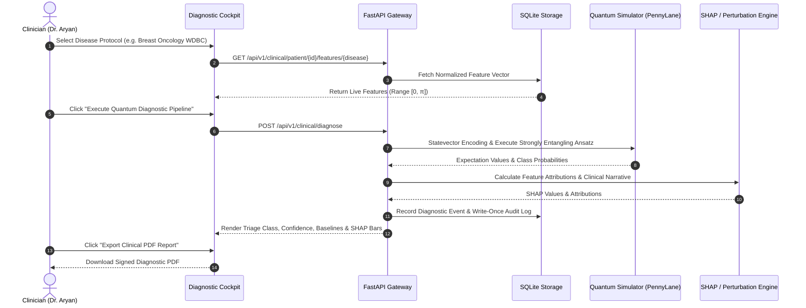
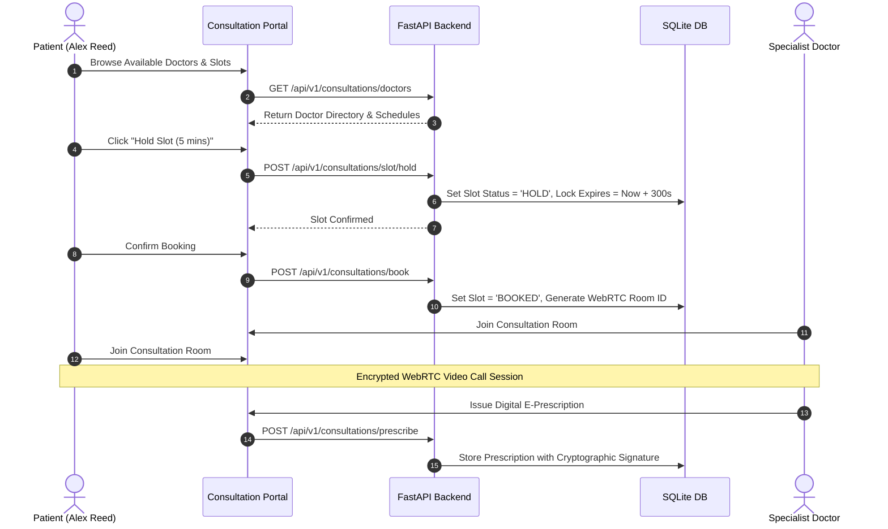

# Q-MedSense: Clinical, Operational & Research Workflows (`docs/CLINICAL_WORKFLOWS.md`)

> **Target Standard:** ISO 29148 / Good Clinical Practice (GCP) Workflow Specifications  
> **Platform:** Q-MedSense Hybrid Quantum Clinical Operating System  

---

## 📑 Table of Contents

1. [Workflow Index & Role Mapping](#1-workflow-index--role-mapping)
2. [Workflow 1: Clinician Hybrid Quantum Diagnostic Pipeline](#2-workflow-1-clinician-hybrid-quantum-diagnostic-pipeline)
3. [Workflow 2: Emergency Department Triage & Instant QR Card Scan](#3-workflow-2-emergency-department-triage--instant-qr-card-scan)
4. [Workflow 3: Multi-Modal Ingestion (HL7 FHIR & Genomic VCF)](#4-workflow-3-multi-modal-ingestion-hl7-fhir--genomic-vcf)
5. [Workflow 4: Doctor Consultation, WebRTC Room & E-Prescriptions](#5-workflow-4-doctor-consultation-webrtc-room--e-prescriptions)
6. [Workflow 5: Researcher Quantum Circuit Retraining & Benchmarking](#6-workflow-5-researcher-quantum-circuit-retraining--benchmarking)
7. [Workflow 6: Patient 2D Digital Twin & DPDP Consent Management](#7-workflow-6-patient-2d-digital-twin--dpdp-consent-management)

---

## 1. Workflow Index & Role Mapping

| Workflow ID | Name | Primary Actor | Target System Component |
| :--- | :--- | :--- | :--- |
| **WF-01** | Hybrid Quantum Diagnostic Pipeline | Clinician (`dr.aryan`) | Diagnostic Cockpit & PennyLane Quantum Engine |
| **WF-02** | Emergency QR Card Triage | Emergency Paramedic / Clinician | Emergency Service & Patient Profile |
| **WF-03** | Multi-Modal Ingestion | Lab Technician / Data Ingestion | HL7 FHIR Parser & VCF Genomic Engine |
| **WF-04** | Teleconsultation & Soft-Lock Booking | Patient & Doctor | WebRTC Video Room & Prescription Signer |
| **WF-05** | Quantum Retraining & Hyperparameter Search | Researcher (`priya.qml`) | Researcher Studio & Model Registry |
| **WF-06** | Digital Twin & DPDP Consent Management | Patient (`alex.patient`) | Patient Portal & Compliance Controller |

---

## 2. Workflow 1: Clinician Hybrid Quantum Diagnostic Pipeline

---

## 3. Workflow 2: Emergency Department Triage & Instant QR Card Scan

When an unconscious or trauma patient arrives at the Emergency Department (ED):
1. **Paramedic Scan:** The paramedic scans the patient's physical or digital Emergency Medical Card QR Code using any standard mobile device or clinical barcode scanner.
2. **Instant Triage Retrieval:** The endpoint `GET /api/v1/emergency/card/{patient_id}` resolves in $< 50\text{ms}$ without requiring full account login, displaying:
   - Critical Blood Group (e.g. `O+`).
   - Severe Allergies (e.g. `Penicillin`, `Latex`).
   - Active Chronic Conditions (e.g. `Type-1 Diabetes`, `Hypertension`).
   - Emergency Contact Phone Numbers.
3. **Audit Logging:** An automated `EMERGENCY_QR_ACCESS` audit event is logged with the scanning IP address and timestamp.

---

## 4. Workflow 3: Multi-Modal Ingestion (HL7 FHIR & Genomic VCF)

1. **FHIR Observation Parsing:**
   - Client uploads standard HL7 FHIR JSON Bundle (`POST /api/v1/early-detection/ingest-fhir`).
   - The parser traverses `Bundle.entry` extracting LOINC coded observations (e.g. Glucose `2339-0`, Blood Pressure `85354-9`).
   - Automatically maps values into normalized quantum feature vectors.
2. **Genomic Variant Calling (VCF):**
   - Client uploads VCF 4.2 genomic sequencing records (`POST /api/v1/early-detection/ingest-vcf`).
   - Parses CHROM, POS, REF, ALT and filters for known pathogenic SNVs (e.g. BRCA1, BRCA2, TP53).
   - Generates high-dimensional genomic embeddings for hybrid quantum risk stratification.

---

## 5. Workflow 4: Doctor Consultation, WebRTC Room & E-Prescriptions

---

## 6. Workflow 5: Researcher Quantum Circuit Retraining & Benchmarking

1. **Select Baseline Dataset:** Wisconsin Breast Cancer (WDBC), Cleveland Heart Disease, or PIMA Indian Diabetes.
2. **Configure Quantum Hyperparameters:**
   - Qubits: $4 \dots 12$
   - Variational Layers: $1 \dots 6$
   - Optimizer: Adam / Parameter-Shift / COBYLA
   - Loss Function: Focal Loss ($\gamma = 2.0$) / Cross-Entropy
3. **Execute Retraining Job:** Backend compiles PennyLane gradient tape and tracks live loss and epoch convergence.
4. **Registry Registration:** Automatically logs final metrics, checkpoint weights, and Quantum Advantage Score (QAS) in `models/registry.json`.

---

## 7. Workflow 6: Patient 2D Digital Twin & DPDP Consent Management

1. **Physiological Avatar Visualization:** The patient views an anatomical 2D digital twin color-coded by organ risk tiers (Green = Low, Amber = Moderate, Red = Elevated).
2. **Timeline History Scrubber:** Patients scrub through diagnostic history across weeks/months to observe risk progression or therapeutic recovery.
3. **Granular DPDP Consent Control:** Patients toggle telemetry sharing, research pooling, and data retention scopes in real-time.

---

**© 2026 Q-MedSense Operations Division. SIH Problem Statement ID 26139.**
