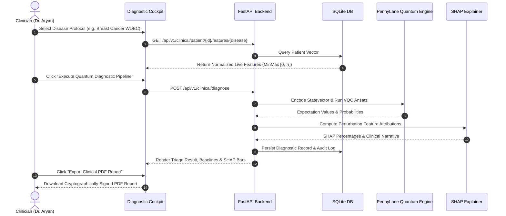

# Q-MedSense: Clinical & Operational Workflows (`docs/CLINICAL_WORKFLOWS.md`)

This guide outlines clinical protocols, researcher pipelines, patient privacy workflows, and administrative compliance procedures within **Q-MedSense**.

---

## 1. Clinician Diagnostic Workflow

---

## 2. Researcher Live Retraining Studio

1. **Dataset Selection:** Choose from standard benchmarks (*Wisconsin Breast Cancer*, *Cleveland Heart Disease*, *PIMA Diabetes*).
2. **Architecture Configuration:** Choose Quantum Class (*VQC Strongly Entangling*, *QSVM Fidelity Kernel*, *QNN Pauli-Z Head*) and loss function (*Focal Loss*, *CrossEntropy*).
3. **Hyperparameter Tuning:** Adjust interactive sliders for Qubits (4–12), Variational Layers (1–6), Epochs (2–15), and Learning Rate ($0.005$–$0.05$).
4. **Execution & Optimization:** The backend uses PennyLane Autograd with Parameter-Shift rules to update ansatz weights.
5. **Model Registry:** Upon completion, the new model checkpoint is registered in the SQLite Model Registry with lineage and convergence metrics.

---

## 3. Patient Portal & DPDP Consent Management

1. **Personal Physiological Avatar:** View synchronized 2D digital twin highlighting organ risk stratification.
2. **Granular DPDP Consent Control:** Toggle active consent for anonymized telemetry sharing, research dataset pooling, and storage retention.
3. **Audit Inspection:** Review complete timestamped access log showing exactly which clinicians and models evaluated their records.
