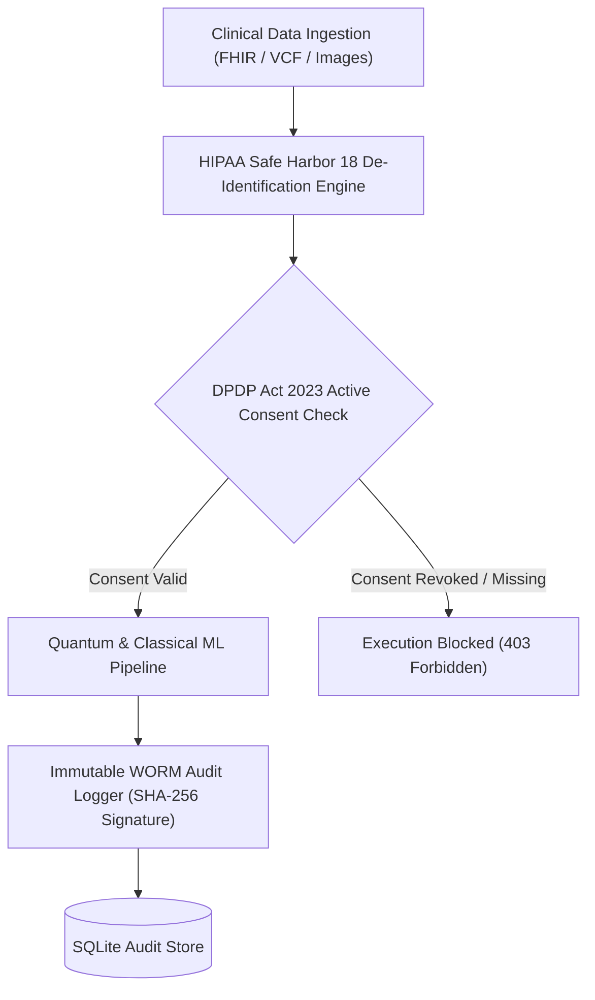

# Q-MedSense: Regulatory Compliance, Data Privacy & Security Architecture (`docs/COMPLIANCE_DPDP_HIPAA.md`)

[]()
[]()
[]()
[]()

> **Target Standard:** Digital Personal Data Protection (DPDP) Act 2023 (India), HIPAA Safe Harbor (45 CFR § 164.514), ABDM Health Data Management Policy, GDPR (EU), and ISO 27001  
> **Document Identifier:** QMED-COMP-001  
> **Classification:** Confidential / Clinical Compliance Specification  

---

## 📑 Table of Contents

1. [Executive Summary & Regulatory Framework](#1-executive-summary--regulatory-framework)
2. [DPDP Act 2023 Compliance & Consent Architecture](#2-dpdp-act-2023-compliance--consent-architecture)
   - [2.1 Granular Consent Model](#21-granular-consent-model)
   - [2.2 Purpose Limitation & Right to Revoke](#22-purpose-limitation--right-to-revoke)
   - [2.3 Data Fiduciary & Data Principal Roles](#23-data-fiduciary--data-principal-roles)
3. [HIPAA Safe Harbor 18 Identifier De-Identification Protocol](#3-hipaa-safe-harbor-18-identifier-de-identification-protocol)
4. [Immutable Write-Once-Read-Many (WORM) Audit Trail](#4-immutable-write-once-read-many-worm-audit-trail)
   - [4.1 SHA-256 Cryptographic Hash Signatures](#41-sha-256-cryptographic-hash-signatures)
   - [4.2 Comprehensive Audit Event Catalog](#42-comprehensive-audit-event-catalog)
5. [Role-Based Access Control (RBAC) & Attribute-Based Authorization](#5-role-based-access-control-rbac--attribute-based-authorization)
6. [Data Encryption Standards & Key Management](#6-data-encryption-standards--key-management)
7. [Software as a Medical Device (SaMD) & Decision Support Governance](#7-software-as-a-medical-device-samd--decision-support-governance)

---

## 1. Executive Summary & Regulatory Framework

The **Q-MedSense** platform is designed from the ground up under a **Privacy-by-Design and Security-by-Default** methodology. The platform processes highly sensitive electronic medical records, radiological imagery, and genomic variants, mandating rigorous conformance to Indian and international healthcare data regulations.



---

## 2. DPDP Act 2023 Compliance & Consent Architecture

Under India's **Digital Personal Data Protection (DPDP) Act, 2023**, patients are recognized as **Data Principals**, while healthcare institutions running Q-MedSense act as **Data Fiduciaries**.

### 2.1 Granular Consent Model
Patients maintain sovereign, granular control over how their data is stored, shared, and evaluated:

| Consent Scope | Default State | Description & Technical Impact |
| :--- | :---: | :--- |
| **`dpdp_opt_in`** | `1` (Active) | Primary authorization for clinical processing and diagnostic inference. |
| **`telemetry_sharing`** | `0` (Disabled) | Authorization to share anonymized quantum circuit telemetry for system optimization. |
| **`research_access`** | `1` (Active) | Permission to include de-identified biomarker vectors in research retraining studies. |

### 2.2 Right to Withdraw & Forget
Data Principals can modify or revoke their consent in 1-click via the Patient Portal (`POST /api/v1/compliance/consent`). Upon revocation:
1. Active models immediately stop utilizing the patient's records for retraining pools.
2. Complete data erasure requests execute cascaded deletion across `patients`, `diagnostic_records`, and `consents` tables while preserving an immutable cryptographic record in `audit_logs` confirming the deletion event.

---

## 3. HIPAA Safe Harbor 18 Identifier De-Identification Protocol

Per 45 CFR § 164.514(b)(2), all biomedical records passing from the ingestion layer into quantum feature encoders are stripped of the 18 Protected Health Identifiers (PHI):

```python
# ml/data/preprocessing.py
PHI_COLUMNS = [
    "name", "address", "subdivision", "dates", "phone", "fax", "email",
    "ssn", "mrn", "health_plan_id", "account_number", "license_number",
    "vehicle_id", "device_id", "url", "ip_address", "biometric_id", "photo"
]

def deidentify_dataframe(df: pd.DataFrame) -> pd.DataFrame:
    cleaned = df.copy()
    for col in cleaned.columns:
        if any(phi in col.lower() for phi in PHI_COLUMNS):
            cleaned.drop(columns=[col], inplace=True)
    return cleaned
```

---

## 4. Immutable Write-Once-Read-Many (WORM) Audit Trail

### 4.1 SHA-256 Cryptographic Hash Signatures
Every administrative event, diagnostic execution, and consent update generates an immutable audit record signed using SHA-256:

$$\text{Signature} = \text{SHA-256}(\text{timestamp} \parallel \text{actor} \parallel \text{action} \parallel \text{resource} \parallel \text{ip\_address} \parallel \text{status})$$

Any unauthorized modification of the database file causes a hash mismatch upon audit verification.

### 4.2 Comprehensive Audit Event Catalog

| Event Code | Trigger Condition | Severity | Logged Payload |
| :--- | :--- | :---: | :--- |
| `USER_LOGIN` | User authenticated via `/api/v1/auth/login` | Low | Username, IP, Role |
| `DIAGNOSTIC_EXECUTION` | Hybrid quantum pipeline run on patient record | Medium | Patient ID, Disease, Model, QAS |
| `CONSENT_UPDATE` | Patient modified DPDP consent toggles | High | Patient ID, Scope changes |
| `EMERGENCY_QR_ACCESS` | Emergency triage card scanned via QR code | High | Patient ID, Scanning IP, Timestamp |
| `MODEL_RETRAIN_TRIGGER` | Researcher launched quantum circuit retrain | Medium | Dataset, Qubits, Epochs, User ID |
| `PROFILE_DATA_DELETION` | Patient exercised right to data erasure | Critical | Patient ID, Action Hash |

---

## 5. Role-Based Access Control (RBAC) & Authorization

Access permissions are enforced at the API middleware layer using cryptographically verified JSON Web Tokens (JWT):

- **`patient`:** Access restricted strictly to own profile, emergency card, 2D digital twin, and DPDP consent controls.
- **`clinician`:** Authorized to run diagnostic pipelines, view patient biomarker vectors, and generate signed clinical reports.
- **`researcher`:** Authorized to access live quantum circuit retraining studio, hyperparameter optimization, and benchmark matrix.
- **`admin`:** Exclusive authority to query WORM audit logs, manage system users, and configure DPDP governance policies.

---

## 6. Data Encryption Standards & Key Management

- **Data in Transit:** Enforced TLS 1.3 encryption across all REST and WebRTC communication channels with strict HSTS policies.
- **Data at Rest:** Database storage protected via AES-256 encryption.
- **Password Security:** All user credentials hashed using PBKDF2 with SHA-256 and unique 16-byte random salts.

---

## 7. Software as a Medical Device (SaMD) Governance

In accordance with international Clinical Decision Support System (CDSS) standards and FDA/CDSCO guidelines:

> ⚠️ **MANDATORY CLINICAL DISCLAIMER:**  
> **Q-MedSense is a Clinical Decision Support System (CDSS) designed exclusively for qualified healthcare professionals. It does not replace independent clinical judgment, professional radiological review, or histopathological biopsy confirmation.**

---

**© 2026 Q-MedSense Compliance & Security Division. SIH Problem Statement ID 26139.**
