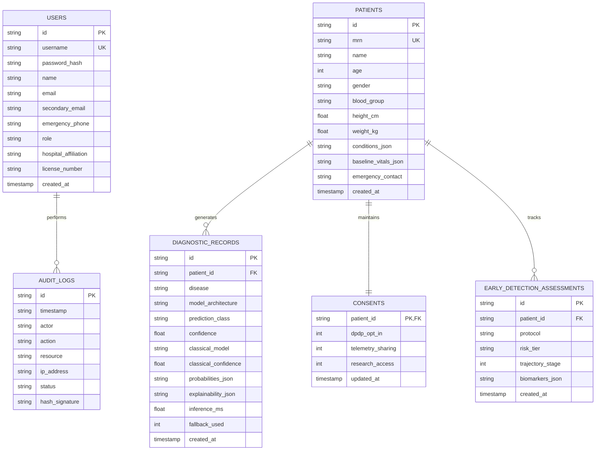

# Q-MedSense: Relational Database Architecture (`docs/DATABASE_SCHEMA.md`)

This document details the SQLite database design, entity relationships, schema definitions, and repository CRUD rules implemented in **Q-MedSense**.

---

## 1. Relational Entity Diagram

---

## 2. Table Specifications & Fields

### Table: `users`
Stores authenticated users across 4 clinical roles: `clinician`, `researcher`, `admin`, `patient`.
- `id` (TEXT, PK): Unique user identifier (e.g. `DR-ARYAN`).
- `username` (TEXT, UNIQUE): System login username.
- `password_hash` (TEXT): Cryptographic hash of the user password.
- `name` (TEXT): Full legal name of the user.
- `email` (TEXT): Primary contact and institutional email.
- `secondary_email` (TEXT, NULLABLE): Recovery and secondary email ID for alert dispatches.
- `emergency_phone` (TEXT, NULLABLE): 24/7 emergency contact telephone.
- `role` (TEXT): User authority tier controlling RBAC navigation.
- `hospital_affiliation` (TEXT): Institutional department or clinical center.
- `license_number` (TEXT): Medical council or professional license ID.

### Table: `patients`
Captures clinical demographics, physiological baselines, and condition flags.
- `id` (TEXT, PK): Patient ID (e.g. `PT-89421`).
- `mrn` (TEXT, UNIQUE): Medical Record Number with masking support.
- `name` (TEXT): Patient full name.
- `age` (INTEGER), `gender` (TEXT), `blood_group` (TEXT).
- `height_cm` (REAL), `weight_kg` (REAL).
- `conditions_json` (TEXT): JSON array of active condition flags.
- `baseline_vitals_json` (TEXT): JSON object with heart rate, blood pressure, SpO2, and temperature.

### Table: `diagnostic_records`
Immutable storage of every hybrid quantum and classical inference event.
- `id` (TEXT, PK): Diagnostic run ID (e.g. `DX-B3901A7C`).
- `patient_id` (TEXT, FK -> `patients.id`).
- `disease` (TEXT): Protocol name (e.g. `Breast Oncology (WDBC)`).
- `model_architecture` (TEXT): Quantum model used (e.g. `VQC (8-Qubit)`).
- `prediction_class` (TEXT): Triage classification.
- `confidence` (REAL): Quantum prediction confidence (0.0 to 1.0).
- `classical_model` (TEXT): Baseline model (e.g. `Logistic Regression`).
- `classical_confidence` (REAL): Baseline confidence.
- `probabilities_json` (TEXT): Full probability distribution.
- `explainability_json` (TEXT): SHAP perturbation attributions & clinical narrative.
- `inference_ms` (REAL): Measured execution latency in milliseconds.

### Table: `audit_logs`
WORM (Write-Once-Read-Many) compliant audit trail per DPDP Act 2023 and HIPAA Safe Harbor.
- `id` (TEXT, PK): Audit event ID.
- `timestamp` (TEXT): ISO 8601 UTC timestamp.
- `actor` (TEXT): User or service performing the action.
- `action` (TEXT): Action type (`DIAGNOSTIC_EXECUTION`, `USER_LOGIN`, `DPDP_CONSENT_UPDATE`).
- `resource` (TEXT): Target patient, protocol, or endpoint.
- `ip_address` (TEXT): Client network IP.
- `status` (TEXT): `SUCCESS` or `FLAGGED`.
- `hash_signature` (TEXT): SHA-256 digital signature of the audit entry.

---

## 3. Data Fetching & Zero-Default Policy

1. **Zero Dummy Data:** All frontend components initialize strictly to `0%`, `0.00`, or `Unanalyzed` states prior to execution.
2. **Transactional Integrity:** All database operations are wrapped in safe context-managed SQLite connections with automatic commit on success and rollback on error.
3. **Audit Immutability:** Audit log entries cannot be modified or deleted through the API layer.
