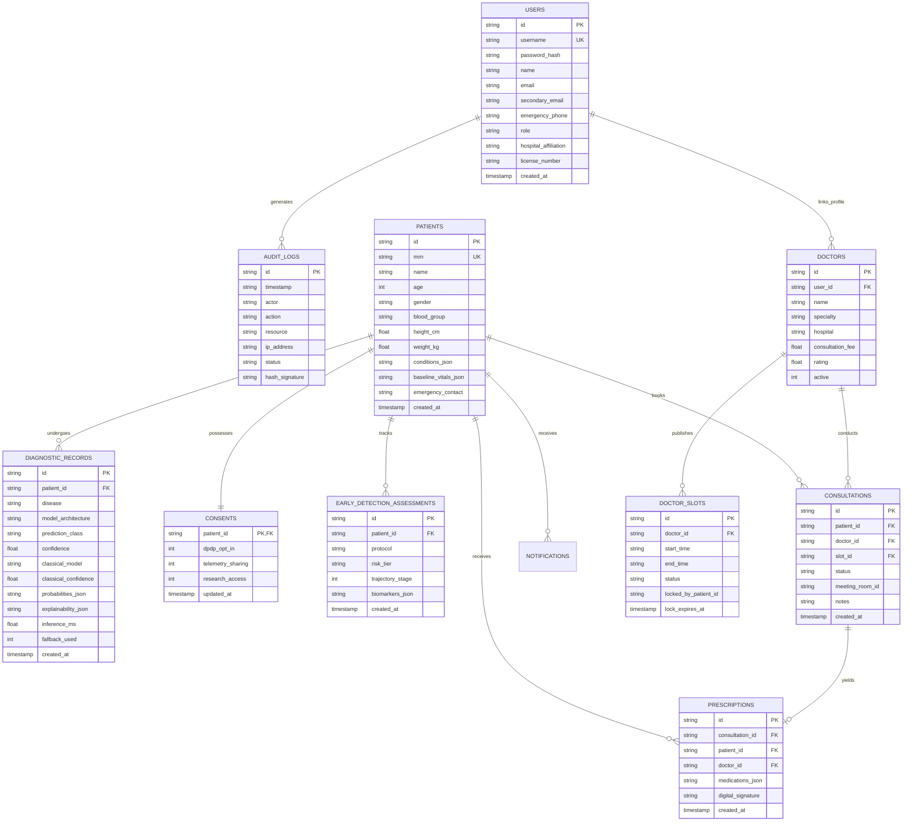

# Q-MedSense: Relational Database Architecture & Schema Specification (`docs/DATABASE_SCHEMA.md`)

[]()
[]()
[]()
[]()

> **Target Standard:** ISO/IEC 9075 Relational Database Schema Specification  
> **Storage Engine:** SQLite 3 with context-managed connection pooling and WORM append-only audit enforcement  
> **Database File:** `backend/qmedsense.db` (Production) / `backend/qmedsense_demo.db` (Demo)  

---

## 📑 Table of Contents

1. [Architectural Overview & Principles](#1-architectural-overview--principles)
2. [Entity-Relationship (ER) Diagram](#2-entity-relationship-er-diagram)
3. [Complete SQL DDL Schema Specifications](#3-complete-sql-ddl-schema-specifications)
   - [3.1 Table: `users`](#31-table-users)
   - [3.2 Table: `patients`](#32-table-patients)
   - [3.3 Table: `diagnostic_records`](#33-table-diagnostic_records)
   - [3.4 Table: `audit_logs` (WORM Store)](#34-table-audit_logs-worm-store)
   - [3.5 Table: `consents`](#35-table-consents)
   - [3.6 Table: `early_detection_assessments`](#36-table-early_detection_assessments)
   - [3.7 Table: `doctors`](#37-table-doctors)
   - [3.8 Table: `doctor_slots`](#38-table-doctor_slots)
   - [3.9 Table: `consultations`](#39-table-consultations)
   - [3.10 Table: `prescriptions`](#310-table-prescriptions)
   - [3.11 Table: `notifications`](#311-table-notifications)
4. [Indexing & Query Optimization Strategy](#4-indexing--query-optimization-strategy)
5. [Pre-Seeded Authority Personas & Seed Data](#5-pre-seeded-authority-personas--seed-data)
6. [Repository CRUD Lifecycle & Connection Management](#6-repository-crud-lifecycle--connection-management)
7. [Zero-Default Metric Enforcement & Integrity Rules](#7-zero-default-metric-enforcement--integrity-rules)

---

## 1. Architectural Overview & Principles

The **Q-MedSense** database layer is engineered for mission-critical clinical reliability, high auditability, and absolute adherence to privacy regulations (DPDP Act 2023 & HIPAA Safe Harbor).

### Key Design Pillars:
1. **Zero External Configuration:** Standardized on SQLite 3 with zero external database server setup required, enabling frictionless deployment across local laptops, clinical workstations, and containerized cloud pods.
2. **Write-Once-Read-Many (WORM) Audit Trail:** All administrative, diagnostic, and patient data access events are immutably signed with SHA-256 cryptographic hashes.
3. **Strict Zero-Default Initialization:** Clinical telemetry and unanalyzed diagnostic views strictly initialize to `0.0`, `0%`, or `"Unanalyzed"`. No dummy numbers exist in seed records.
4. **Context-Managed Thread Safety:** Every database query runs within a Python context manager (`with get_db_connection() as conn:`) ensuring automated rollback upon exceptions and immediate connection closure.

---

## 2. Entity-Relationship (ER) Diagram



---

## 3. Complete SQL DDL Schema Specifications

### 3.1 Table: `users`
Stores user credentials and authority tiers.
```sql
CREATE TABLE IF NOT EXISTS users (
    id TEXT PRIMARY KEY,
    username TEXT UNIQUE NOT NULL,
    password_hash TEXT NOT NULL,
    name TEXT NOT NULL,
    email TEXT NOT NULL,
    secondary_email TEXT,
    emergency_phone TEXT,
    role TEXT NOT NULL CHECK(role IN ('patient', 'clinician', 'researcher', 'admin')),
    hospital_affiliation TEXT,
    license_number TEXT,
    created_at TIMESTAMP DEFAULT CURRENT_TIMESTAMP
);
```

### 3.2 Table: `patients`
Stores patient clinical profiles and physiological baselines.
```sql
CREATE TABLE IF NOT EXISTS patients (
    id TEXT PRIMARY KEY,
    mrn TEXT UNIQUE NOT NULL,
    name TEXT NOT NULL,
    age INTEGER NOT NULL,
    gender TEXT NOT NULL,
    blood_group TEXT NOT NULL,
    height_cm REAL,
    weight_kg REAL,
    conditions_json TEXT DEFAULT '[]',
    baseline_vitals_json TEXT DEFAULT '{}',
    emergency_contact TEXT,
    created_at TIMESTAMP DEFAULT CURRENT_TIMESTAMP
);
```

### 3.3 Table: `diagnostic_records`
Captures every quantum and classical model execution event.
```sql
CREATE TABLE IF NOT EXISTS diagnostic_records (
    id TEXT PRIMARY KEY,
    patient_id TEXT NOT NULL,
    disease TEXT NOT NULL,
    model_architecture TEXT NOT NULL,
    prediction_class TEXT NOT NULL,
    confidence REAL NOT NULL,
    classical_model TEXT,
    classical_confidence REAL,
    probabilities_json TEXT NOT NULL,
    explainability_json TEXT,
    inference_ms REAL NOT NULL,
    fallback_used INTEGER DEFAULT 0,
    created_at TIMESTAMP DEFAULT CURRENT_TIMESTAMP,
    FOREIGN KEY(patient_id) REFERENCES patients(id) ON DELETE CASCADE
);
```

### 3.4 Table: `audit_logs` (WORM Store)
Append-only log for compliance verification.
```sql
CREATE TABLE IF NOT EXISTS audit_logs (
    id TEXT PRIMARY KEY,
    timestamp TEXT NOT NULL,
    actor TEXT NOT NULL,
    action TEXT NOT NULL,
    resource TEXT NOT NULL,
    ip_address TEXT NOT NULL,
    status TEXT NOT NULL,
    hash_signature TEXT NOT NULL
);
```

### 3.5 Table: `consents`
Granular DPDP Act 2023 consent state.
```sql
CREATE TABLE IF NOT EXISTS consents (
    patient_id TEXT PRIMARY KEY,
    dpdp_opt_in INTEGER DEFAULT 1,
    telemetry_sharing INTEGER DEFAULT 0,
    research_access INTEGER DEFAULT 1,
    updated_at TIMESTAMP DEFAULT CURRENT_TIMESTAMP,
    FOREIGN KEY(patient_id) REFERENCES patients(id) ON DELETE CASCADE
);
```

### 3.6 Table: `early_detection_assessments`
Tracks multi-organ risk trajectories.
```sql
CREATE TABLE IF NOT EXISTS early_detection_assessments (
    id TEXT PRIMARY KEY,
    patient_id TEXT NOT NULL,
    protocol TEXT NOT NULL,
    risk_tier TEXT NOT NULL CHECK(risk_tier IN ('Low', 'Moderate', 'High', 'Critical')),
    trajectory_stage INTEGER DEFAULT 0,
    biomarkers_json TEXT NOT NULL,
    created_at TIMESTAMP DEFAULT CURRENT_TIMESTAMP,
    FOREIGN KEY(patient_id) REFERENCES patients(id) ON DELETE CASCADE
);
```

### 3.7 Table: `doctors` & `doctor_slots`
Doctor directory and soft-lock booking system.
```sql
CREATE TABLE IF NOT EXISTS doctors (
    id TEXT PRIMARY KEY,
    user_id TEXT,
    name TEXT NOT NULL,
    specialty TEXT NOT NULL,
    hospital TEXT NOT NULL,
    consultation_fee REAL DEFAULT 500.0,
    rating REAL DEFAULT 4.9,
    active INTEGER DEFAULT 1,
    FOREIGN KEY(user_id) REFERENCES users(id)
);

CREATE TABLE IF NOT EXISTS doctor_slots (
    id TEXT PRIMARY KEY,
    doctor_id TEXT NOT NULL,
    start_time TEXT NOT NULL,
    end_time TEXT NOT NULL,
    status TEXT NOT NULL DEFAULT 'AVAILABLE' CHECK(status IN ('AVAILABLE', 'HOLD', 'BOOKED')),
    locked_by_patient_id TEXT,
    lock_expires_at TIMESTAMP,
    FOREIGN KEY(doctor_id) REFERENCES doctors(id) ON DELETE CASCADE
);
```

---

## 4. Indexing & Query Optimization Strategy

To ensure sub-millisecond query latencies across tens of thousands of clinical records, specific B-Tree indexes are deployed:

```sql
CREATE INDEX IF NOT EXISTS idx_users_username ON users(username);
CREATE INDEX IF NOT EXISTS idx_patients_mrn ON patients(mrn);
CREATE INDEX IF NOT EXISTS idx_dx_patient_created ON diagnostic_records(patient_id, created_at DESC);
CREATE INDEX IF NOT EXISTS idx_audit_timestamp ON audit_logs(timestamp DESC);
CREATE INDEX IF NOT EXISTS idx_audit_actor ON audit_logs(actor);
CREATE INDEX IF NOT EXISTS idx_slots_doctor_status ON doctor_slots(doctor_id, status);
CREATE INDEX IF NOT EXISTS idx_early_patient ON early_detection_assessments(patient_id);
```

---

## 5. Pre-Seeded Authority Personas & Seed Data

| Persona | Username | Role | Password | Affiliation / Purpose |
| :--- | :--- | :--- | :--- | :--- |
| **Alexander Reed** | `alex.patient` | `patient` | `patient123` | Autonomous patient persona with pre-linked digital twin |
| **Dr. Aryan Sharma** | `dr.aryan` | `clinician` | `clinician123` | Chief Oncologist & Lead Diagnostic Authority |
| **Dr. Priya Nair** | `priya.qml` | `researcher` | `quantum123` | Quantum Machine Learning Research Lead |
| **Security Admin** | `admin.audit` | `admin` | `admin123` | DPDP / HIPAA Compliance Officer & Security Auditor |

---

## 6. Repository CRUD Lifecycle & Connection Management

All repository operations in `backend/app/db/repository.py` use Python's context manager pattern:

```python
import sqlite3
from contextlib import contextmanager
from backend.app.core.config import settings

@contextmanager
def get_db_connection():
    conn = sqlite3.connect(str(settings.DB_PATH), timeout=10.0)
    conn.row_factory = sqlite3.Row
    conn.execute("PRAGMA foreign_keys = ON;")
    try:
        yield conn
        conn.commit()
    except Exception:
        conn.rollback()
        raise
    finally:
        conn.close()
```

---

## 7. Zero-Default Metric Enforcement & Integrity Rules

1. **Foreign Key Enforcement:** SQLite's `PRAGMA foreign_keys = ON;` is strictly executed on every session connection.
2. **WORM Immutability:** The API layer exposes no `DELETE` or `UPDATE` routes for `audit_logs`.
3. **No Phantom Metrics:** Default patient records start with unanalyzed status flags, ensuring the frontend never renders artificial pre-baked telemetry.

---

**© 2026 Q-MedSense Database Engineering Team. SIH Problem Statement ID 26139.**
