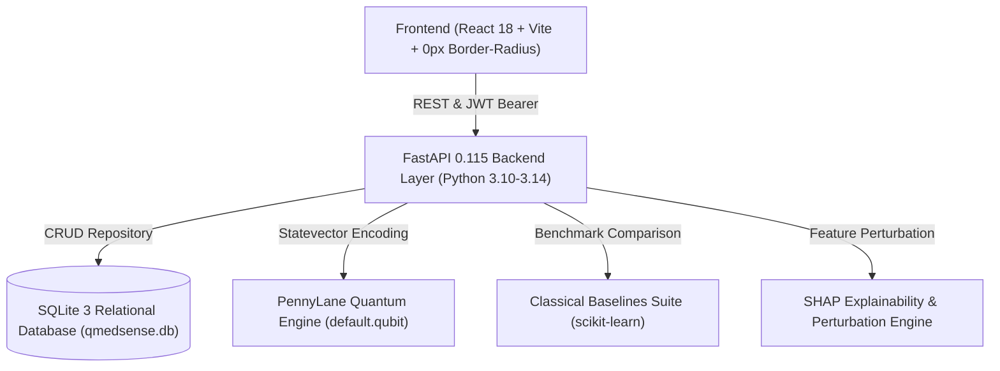

# Q-MedSense: Master Documentation Index (`docs/INDEX.md`)

Welcome to the technical and architectural documentation index for **Q-MedSense: Hybrid Quantum Machine Learning Clinical Decision Support Platform** (Smart India Hackathon Problem Statement ID 26139).

---

## Documentation Directory

| Document | Description | Key Topics |
| :--- | :--- | :--- |
| [run.md](file:///c:/Users/aryan/OneDrive/Desktop/doc/run.md) | **Step-by-Step Run Guide** | Prerequisites, one-click scripts, manual launch, test commands, personas |
| [docs/ARCHITECTURE.md](file:///c:/Users/aryan/OneDrive/Desktop/doc/docs/architecture.md) | **System Architecture** | Hybrid quantum-classical pipeline, zero-border UI layout, submodules |
| [docs/DATABASE_SCHEMA.md](file:///c:/Users/aryan/OneDrive/Desktop/doc/docs/DATABASE_SCHEMA.md) | **SQLite Database Design** | Relational tables (`users`, `patients`, `diagnostic_records`, `audit_logs`, `consents`), CRUD repository |
| [docs/QUANTUM_ALGORITHMS.md](file:///c:/Users/aryan/OneDrive/Desktop/doc/docs/QUANTUM_ALGORITHMS.md) | **Quantum Algorithms & Mathematics** | VQC ansatz, QSVM kernels, QNN expectations, Quantum Advantage Score (QAS) |
| [docs/API_SPEC.md](file:///c:/Users/aryan/OneDrive/Desktop/doc/docs/API_SPEC.md) | **REST API Specification** | Endpoints for clinical diagnosis, benchmarks, early detection, auth, compliance |
| [docs/COMPLIANCE_DPDP_HIPAA.md](file:///c:/Users/aryan/OneDrive/Desktop/doc/docs/COMPLIANCE_DPDP_HIPAA.md) | **Regulatory & Security** | DPDP Act 2023, HIPAA Safe Harbor, WORM audit trail, SaMD disclaimers |
| [docs/CLINICAL_WORKFLOWS.md](file:///c:/Users/aryan/OneDrive/Desktop/doc/docs/CLINICAL_WORKFLOWS.md) | **Clinical & Operational Workflows** | Triage protocols, multi-organ trajectories, researcher studio, patient portal |
| [docs/FORMULA_SHEET.md](file:///c:/Users/aryan/OneDrive/Desktop/doc/docs/FORMULA_SHEET.md) | **Mathematical Formula Sheet** | Mathematical definitions of MCC, QAS, Fidelity Kernels, SHAP perturbations |
| [docs/ISSUES_RESOLVED.md](file:///c:/Users/aryan/OneDrive/Desktop/doc/docs/ISSUES_RESOLVED.md) | **Issue & Defect Resolution Log** | Complete catalog of algorithmic, ingestion, and accessibility fixes |
| [docs/SRS.md](file:///c:/Users/aryan/OneDrive/Desktop/doc/docs/SRS.md) | **IEEE 830 Software Requirements Spec** | Full requirement specifications and functional scope |

---

## Technical Stack Overview

