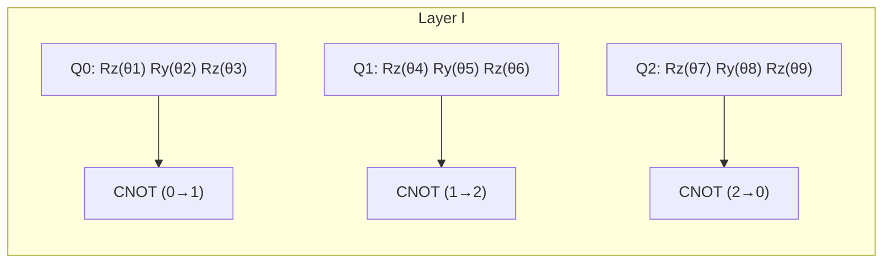

# Q-MedSense: Quantum Machine Learning Algorithms & Mathematical Foundations (`docs/QUANTUM_ALGORITHMS.md`)

> **Target Problem Statement:** Smart India Hackathon 2026 — ID 26139  
> **Theoretical Foundation:** Noisy Intermediate-Scale Quantum (NISQ) Parameterized Quantum Circuits (PQCs), Quantum Kernel Methods, and Hybrid Vision QNN Architectures.  

---

## 📑 Table of Contents

1. [Mathematical Foundations & Hilbert Space Representation](#1-mathematical-foundations--hilbert-space-representation)
2. [Quantum Feature Maps & State Preparation](#2-quantum-feature-maps--state-preparation)
   - [2.1 Hardware-Efficient Angle Embedding](#21-hardware-efficient-angle-embedding)
   - [2.2 Dense Amplitude Encoding](#22-dense-amplitude-encoding)
   - [2.3 Non-Linear ZZ-Entangling Feature Map](#23-non-linear-zz-entangling-feature-map)
3. [Parameterized Quantum Circuit (PQC) Ansatz Architectures](#3-parameterized-quantum-circuit-pqc-ansatz-architectures)
   - [3.1 Strongly Entangling Ansatz](#31-strongly-entangling-ansatz)
   - [3.2 Hardware-Efficient Ring Ansatz](#32-hardware-efficient-ring-ansatz)
   - [3.3 Multi-Layer Data Re-Uploading Principle](#33-multi-layer-data-re-uploading-principle)
4. [Analytic Gradient Computation & Optimization](#4-analytic-gradient-computation--optimization)
   - [4.1 The Parameter-Shift Rule](#41-the-parameter-shift-rule)
   - [4.2 Barren Plateau Mitigation & Variance Analysis](#42-barren-plateau-mitigation--variance-analysis)
5. [Quantum Support Vector Machine (QSVM) & Kernel Methods](#5-quantum-support-vector-machine-qsvm--kernel-methods)
   - [5.1 Quantum Transition Fidelity Kernel](#51-quantum-transition-fidelity-kernel)
   - [5.2 Dual Quadratic Optimization Formulation](#52-dual-quadratic-optimization-formulation)
6. [Hybrid Quantum Neural Networks (QNN) & Multi-Class Heads](#6-hybrid-quantum-neural-networks-qnn--multi-class-heads)
7. [Specialized Quantum Clinical Architectures](#7-specialized-quantum-clinical-architectures)
   - [7.1 HAM10000 Skin Lesion QNNs (`QuantumDerma` Family)](#71-ham10000-skin-lesion-qnns-quantumderma-family)
   - [7.2 Chest X-Ray Pneumonia Classifier (`QuantumPneu`)](#72-chest-x-ray-pneumonia-classifier-quantumpneu)
8. [Quantum Advantage Score (QAS) & Fair Benchmarking](#8-quantum-advantage-score-qas--fair-benchmarking)

---

## 1. Mathematical Foundations & Hilbert Space Representation

In classical machine learning, a clinical sample $x \in \mathbb{R}^D$ is mapped to a feature space $\mathcal{X}$. In Quantum Machine Learning (QML), this vector is mapped to a state vector in an exponential $2^N$-dimensional complex Hilbert space $\mathcal{H}$:

$$\Phi: \mathbb{R}^D \to \mathcal{H} \cong \mathbb{C}^{2^N}, \quad x \mapsto |\psi(x)\rangle$$

The quantum state $|\psi(x)\rangle$ satisfies the normalization condition $\langle \psi(x) | \psi(x) \rangle = 1$. The state evolution under a unitary quantum circuit $U(x, \theta)$ parameterized by classical weights $\theta$ is:

$$|\psi(x, \theta)\rangle = U(x, \theta) |0\rangle^{\otimes N}$$

---

## 2. Quantum Feature Maps & State Preparation

### 2.1 Hardware-Efficient Angle Embedding
Continuous clinical features $x = [x_1, x_2, \dots, x_N]^T$ are normalized into $[-\pi, \pi]$ and encoded via single-qubit Pauli-Y rotation gates:

$$|\psi_0(x)\rangle = \bigotimes_{i=1}^N R_Y(x_i) |0\rangle_i = \bigotimes_{i=1}^N \left( \cos\left(\frac{x_i}{2}\right)|0\rangle_i + \sin\left(\frac{x_i}{2}\right)|1\rangle_i \right)$$

where the single-qubit rotation matrix is:
$$R_Y(\theta) = \begin{pmatrix} \cos(\theta/2) & -\sin(\theta/2) \\ \sin(\theta/2) & \cos(\theta/2) \end{pmatrix}$$

### 2.2 Dense Amplitude Encoding
For high-dimensional feature vectors (e.g. $D = 2^N$), amplitude encoding maps the entire normalized vector into the amplitudes of an $N$-qubit superposition:

$$|\psi(x)\rangle = \sum_{k=0}^{2^N-1} x_k |k\rangle, \quad \text{subject to} \sum_{k=0}^{2^N-1} |x_k|^2 = 1$$

### 2.3 Non-Linear ZZ-Entangling Feature Map
To capture non-linear cross-feature correlations (e.g. tumor radius $\times$ concave points), the second-order Pauli expansion feature map applies:

$$U_{\Phi}(x) = \exp\left( i \sum_{j=1}^N x_j Z_j + i \sum_{j < k} (\pi - x_j)(\pi - x_k) Z_j Z_k \right)$$

$$|\psi(x)\rangle = U_{\Phi}(x) H^{\otimes N} |0\rangle^{\otimes N}$$

---

## 3. Parameterized Quantum Circuit (PQC) Ansatz Architectures

### 3.1 Strongly Entangling Ansatz
Implemented in `QuantumDerma` and `VQC`, the strongly entangling ansatz maximizes expressibility and entanglement capability across all $N$ qubits over $L$ variational layers.

For each layer $l \in \{1, \dots, L\}$:
1. **Arbitrary Single-Qubit Rotations:**
   $$V_l(\theta) = \bigotimes_{i=1}^N R_Z(\theta_{l,i,3}) R_Y(\theta_{l,i,2}) R_Z(\theta_{l,i,1})$$
2. **Periodic Circular CNOT Mesh:**
   $$W_l = \prod_{i=1}^N \text{CNOT}_{(i, (i + l) \bmod N)}$$

The total unitary evolution is:
$$U(\theta) = \prod_{l=1}^L \left( W_l \cdot V_l(\theta) \right)$$

### 3.2 Multi-Layer Data Re-Uploading Principle
To overcome the expressivity limitations of shallow quantum circuits, **Data Re-Uploading** injects feature vector $x$ at every layer $l$ alongside the trainable parameters $\theta_l$:

$$U(x, \theta) = \prod_{l=1}^L \left[ W_l \cdot V(\theta_l) \cdot S(x) \right]$$

This creates a Fourier series representation with high accessible frequency harmonics, enabling the model to fit complex non-linear clinical decision boundaries.

---

## 4. Analytic Gradient Computation & Optimization

### 4.1 The Parameter-Shift Rule
Unlike classical backpropagation, which requires storing intermediate quantum state vectors (infeasible on physical quantum hardware), exact analytic gradients are computed via the **Parameter-Shift Rule**:

$$\frac{\partial \langle \hat{O} \rangle}{\partial \theta_k} = \frac{\langle \hat{O} \rangle_{\theta_k + \frac{\pi}{2}} - \langle \hat{O} \rangle_{\theta_k - \frac{\pi}{2}}}{2}$$

For a general loss function $\mathcal{L}(\theta) = f(\langle \hat{O} \rangle(\theta))$:
$$\nabla_{\theta_k} \mathcal{L} = \frac{\partial \mathcal{L}}{\partial \langle \hat{O} \rangle} \cdot \left( \frac{\langle \hat{O} \rangle(\theta + \frac{\pi}{2} e_k) - \langle \hat{O} \rangle(\theta - \frac{\pi}{2} e_k)}{2} \right)$$

### 4.2 Barren Plateau Mitigation
To prevent vanishing gradients in deep PQCs ($\text{Var}[\partial_k \mathcal{L}] \sim \mathcal{O}(2^{-N})$), Q-MedSense implements:
1. **Conservative Depth Bounds:** Restricting ansatz depth to $L \le 4$ layers for $N \le 12$ qubits.
2. **Local Pauli-Z Observables:** Measuring single-qubit operators $\hat{O} = Z_i$ rather than global operators $Z_1 \otimes Z_2 \dots \otimes Z_N$.
3. **Identity Initialization:** Initializing rotation angles $\theta$ near 0 to avoid random Haar-distributed states.

---

## 5. Quantum Support Vector Machine (QSVM) & Kernel Methods

### 5.1 Quantum Transition Fidelity Kernel
QSVM implicitly projects clinical data into high-dimensional Hilbert space and evaluates pairwise inner products via state transition fidelity:

$$K(x_i, x_j) = |\langle \psi(x_i) | \psi(x_j) \rangle|^2 = \text{Tr}\left( \rho(x_i) \rho(x_j) \right)$$

On quantum circuits, $K(x_i, x_j)$ is computed by executing the state preparation circuit $U(x_i)$ followed by the inverse adjoint circuit $U^\dagger(x_j)$ and measuring the return probability to ground state $|0\rangle^{\otimes N}$:

$$K(x_i, x_j) = |\langle 0^{\otimes N} | U^\dagger(x_j) U(x_i) | 0^{\otimes N} \rangle|^2$$

### 5.2 Dual Quadratic Optimization Formulation
The kernel matrix $K \in \mathbb{R}^{M \times M}$ is passed to the classical dual formulation:

$$\max_{\alpha} \sum_{i=1}^M \alpha_i - \frac{1}{2} \sum_{i=1}^M \sum_{j=1}^M \alpha_i \alpha_j y_i y_j K(x_i, x_j)$$

$$\text{subject to } 0 \le \alpha_i \le C \quad \forall i, \quad \sum_{i=1}^M \alpha_i y_i = 0$$

---

## 6. Hybrid Quantum Neural Networks (QNN) & Multi-Class Heads

For multi-class clinical triage (e.g. 7-class HAM10000 skin lesions), expectation values from all $N$ qubits are extracted:

$$\mathbf{z} = \left[ \langle Z_0 \rangle, \langle Z_1 \rangle, \dots, \langle Z_{N-1} \rangle \right]^T \in [-1, 1]^N$$

The expectation vector $\mathbf{z}$ is mapped through a layer-normalized linear head:
$$\hat{\mathbf{y}} = \text{Softmax}\left( \frac{W \cdot \text{LayerNorm}(\mathbf{z}) + \mathbf{b}}{T} \right)$$

where $T$ is the temperature scaling parameter calibrated via Platt scaling / temperature scaling to minimize Expected Calibration Error (ECE).

---

## 7. Specialized Quantum Clinical Architectures

### 7.1 HAM10000 Skin Lesion QNNs (`QuantumDerma` Family)

| Architecture | Qubits | Layers | Ansatz | Data Re-uploading | Primary Application |
| :--- | :---: | :---: | :--- | :---: | :--- |
| **`QuantumDerma`** | 10 | 4 | Strongly Entangling | Yes | High-accuracy 7-class dermoscopy |
| **`QuantumDermaX`** | 12 | 4 | Extended Hilbert Space | Yes | Fine-grained melanoma boundary analysis |
| **`VitaQ-Derm`** | 10 | 4 | Learned Non-Linear Projection | Yes | Fast inference with pre-trained warm start |
| **`QSkin-Vortex`** | 10 | 5 | Deep Variational Mesh | Yes | Research benchmark for deep entanglement |

### 7.2 Chest X-Ray Pneumonia Classifier (`QuantumPneu`)
- **Backbone Extractor:** Pre-trained EfficientNet-B0 / PneuVision (1280-dim representation).
- **Dimensionality Reduction:** 8-component PCA fitted strictly on training split.
- **Quantum Core:** 8-qubit, 4-layer Strongly Entangling circuit with angle embedding.
- **Loss Function:** Class-weighted Focal Loss ($\gamma = 2.0$) with validation-tuned optimal decision threshold.

---

## 8. Quantum Advantage Score (QAS) & Fair Benchmarking

To ensure scientific honesty and prevent misleading claims, Q-MedSense benchmarks quantum models using the standardized **Quantum Advantage Score (QAS)**:

$$\text{QAS} = \left( \frac{\text{Acc}_q - \text{Acc}_c}{\text{Acc}_c} \right) \cdot \left( \frac{T_c}{T_q} \right)$$

Where:
- $\text{Acc}_q$: Quantum model test accuracy.
- $\text{Acc}_c$: Best classical baseline test accuracy (Random Forest, XGBoost, or DenseNet-121).
- $T_q$: Quantum simulation latency per sample (ms).
- $T_c$: Classical baseline inference latency per sample (ms).

A positive $\text{QAS} > 0$ denotes quantum performance improvement that outweighs execution overhead.

---

**© 2026 Q-MedSense Quantum Engineering Team. SIH Problem Statement ID 26139.**
