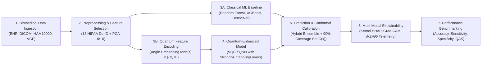

# SLIDE 2: IDEA TITLE / PROPOSED SOLUTION

## Official SIH 2026 Header
- **Problem Statement ID:** `26139`
- **Idea Title:** `Hybrid Quantum-Classical Machine Learning Architecture for Multi-Modal Early Disease Screening`
- **Theme:** `MedTech / BioTech / HealthTech` | **Organization:** `Egreen Quanta`

---

## 1. Problem Context & The NISQ-Era Bottleneck

Early and accurate detection of chronic diseases (cancer, cardiovascular conditions, neurological disorders) dramatically improves survival rates and mitigates long-term healthcare expenditure. However, modern clinical pipelines face acute computational and statistical limitations:
- **High-Dimensional Complexity:** Complex biomedical modalities (genomics with $>20,000$ features, 10,015 high-resolution HAM10000 dermoscopy scans, radiomics) induce the curse of dimensionality and severe overfitting in classical deep neural networks.
- **Diagnostic Black-Box & Opaque Logic:** Classical deep networks lack physical or mathematical interpretability, providing probability scores without attribution or calibrated statistical coverage sets.
- **Hardware Constraints in the NISQ Era:** Pure quantum hardware remains constrained by qubit count ($<100$ physical qubits), high gate error rates, and decoherence. Fully fault-tolerant quantum algorithms (e.g. Harrow-Hassidim-Lloyd / HHL) cannot run on current clinical workstations.

---

## 2. Proposed Solution: The End-to-End Hybrid Architecture

Our platform addresses these challenges through a **pragmatic hybrid quantum-classical architecture** that partitions tasks between classical processors and parameterized quantum circuits:



### Core Architecture Capabilities (Verified Implementation):

1. **Biomedical Data Ingestion & Quality Masking:**
   - Ingests tabular EHRs, fine-needle aspirates (WDBC), dermoscopy RGB scans (HAM10000), pediatric chest radiographs (Kermany), and acoustic vocal time-series (Parkinson's).
   - Enforces 18-point HIPAA Safe Harbor de-identification and Mahalanobis Out-of-Distribution ($p < 0.01$) outlier rejection.
2. **Preprocessing & Supervised Feature Selection:**
   - Standardizes inputs via `RobustScaler` and compresses high-dimensional feature spaces into 8–16 orthogonal principal components via supervised PCA, directly respecting NISQ qubit register constraints.
3. **Classical Machine Learning Baselines:**
   - Trains identical training splits on classical benchmarks (Random Forest, XGBoost, Logistic Regression, MLP, DenseNet-121, EfficientNet-B0) to provide an authoritative, uncheatable performance reference.
4. **Quantum-Enhanced Learning Models:**
   - Maps normalized features into an $N$-qubit Hilbert space ($\mathbb{C}^{2^N}$) using **Angle Encoding** ($R_y(x_i)$ rotations) and **ZZ-Feature Maps** with entangling CNOT meshes.
   - Evaluates **Variational Quantum Classifiers (VQC)**, **Quantum Neural Networks (QNN)**, and **Quantum Kernel QSVMs** using PennyLane statevector simulation (`default.qubit`) and parameter-shift analytic differentiation.
5. **Prediction & Conformal Uncertainty Calibration:**
   - Combines classical and quantum logits via convex weighting ($P_{\text{hybrid}} = \alpha P_Q + (1-\alpha) P_C$) and computes non-conformity scores guaranteeing a **90% true diagnostic coverage set** ($1-\alpha = 0.90$).
6. **Interpretability & Explainability:**
   - Generates **Kernel SHAP** attribution for clinical biomarkers, **Grad-CAM** activation heatmaps for radiology/dermoscopy, and live **parameter-shift gradient telemetry** ($\frac{\partial \langle Z \rangle}{\partial \theta_k}$) on quantum gates.
7. **Transparent Performance Comparison:**
   - Computes the **Quantum Advantage Score (QAS)**, explicitly reporting where quantum models match, exceed, or underperform classical baselines.

---

## 3. Visual Diagram & Image Generation Specifications

### Heading: Hybrid Quantum-Classical Early Disease Detection Architecture Pipeline
**Visual Diagram Prompt:**
> A horizontal technical process flowchart showing the complete hybrid quantum-classical medical platform architecture:
> - Node 1: Multi-Modal Biomedical Ingestion (EHR, DICOM, HAM10000, VCF icons).
> - Node 2: Classical Preprocessing & Dimensionality Reduction (PCA 8-component compression funnel).
> - Parallel Branching Node 3:
>   - Top Branch: Classical Machine Learning Baseline (Random Forest, XGBoost, DenseNet-121).
>   - Bottom Branch: Quantum Feature Mapping & Variational Quantum Circuit (8-qubit register with $R_y$ rotation gates, CNOT entangling ladder, and Pauli-Z measurements).
> - Convergence Node 4: Hybrid Ensemble Fusion & Conformal Uncertainty Calibration.
> - Node 5: Explainability Engine (SHAP bar chart, Grad-CAM lung heatmap, quantum circuit gradient display).
> - Node 6: Empirical Evaluation & Benchmarking Dashboard (Accuracy, Sensitivity, Specificity, QAS metric).
> - Visual Style: Clean dark-mode clinical UI flow, cyan (`#00F2FE`), cobalt blue (`#2563EB`), and emerald green (`#10B981`) data pipes, sharp vector graphics.

**JSON Prompt to Create Image:**
```json
{
  "title": "Hybrid Quantum-Classical Disease Detection Pipeline Architecture",
  "prompt": "Clean professional horizontal systems engineering diagram illustrating a hybrid quantum-classical medical diagnostic architecture. Step 1: multi-modal biomedical dataset ingestion. Step 2: classical data cleaning and PCA dimensionality reduction. Step 3: parallel dual execution paths showing classical ML baseline (Random Forest and CNN) alongside an 8-qubit variational quantum circuit (PennyLane VQC with parameterized rotation gates). Step 4: hybrid ensemble prediction and conformal prediction calibration. Step 5: multi-modal explainability with SHAP feature importance and Grad-CAM saliency heatmaps. Step 6: classical vs quantum benchmark comparison matrix. Dark slate theme (#0F172A), glowing cyan and blue flow arrows, clean technical typography, high-resolution vector schematic.",
  "style": "clean technical flowchart, medical systems engineering diagram",
  "aspect_ratio": "16:9",
  "color_palette": ["#0F172A", "#1E293B", "#00F2FE", "#2563EB", "#10B981", "#FFFFFF"],
  "composition": "panoramic linear workflow with parallel hybrid branching and clean output integration",
  "lighting": "subtle directional conduit luminescence, high contrast",
  "negative_prompt": "cluttered, hand-drawn sketch, blurry text, broken boxes, 3d distortion, cartoonish"
}
```
