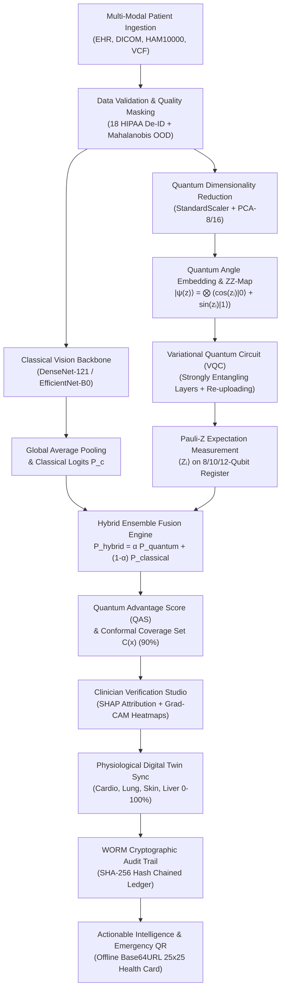

# SLIDE 2: PROBLEM & PROPOSED SOLUTION

**Header:**
- **Platform Brand:** `Q-RAKSHAK`
- **Main Title:** `Q-RAKSHAK: A Sovereign, Quantum-Classical Hybrid Clinical Decision Support Platform for Multi-Modal Early Disease Diagnostics & Digital Twin Intelligence`
- **Hackathon Identifier:** `SMART INDIA HACKATHON 2026 | Problem Statement ID: 26139 | Theme: MedTech / BioTech / HealthTech`

---

## 1. The Problem:

### [Card 1] Dimensionality & High-Entropy Bottleneck
Multi-modal clinical data (genomics with 20,000+ genes, 10,015 high-res HAM10000 dermoscopy images, radiomics, and EHR lab panels) causes exponential feature-space sparsity and severe overfitting in classical deep networks.

### [Card 2] Diagnostic Black-Box & Clinician Mistrust
Deep convolutional networks fail to provide physical or mathematical explainability. Opaque logits and lack of distribution-free uncertainty bounds lead clinicians to reject AI triage due to unquantified hallucination risk.

### [Card 3] Fragmented Multi-Modal Diagnostics
Oncology, cardiology, neurology, and pulmonary diagnostic data remain trapped in isolated silos across disparate hospital EHRs, delaying early cross-organ intervention and missing early systemic disease onset.

### [Card 4] The Edge & Clinical Workstation Bottleneck
Modern high-parameter clinical foundation models require power-hungry, multi-GPU cloud clusters (>300W), making air-gapped, zero-latency execution impossible in rural Primary Health Centers (PHCs) and district clinics.

---

## 2. Our Solution:

- **Dual-Tier Intelligence:** Ultra-lightweight deterministic edge processing for rural clinics (<150 MB, <1.2 GB RAM) paired with a local Sovereign Quantum Hub for advanced multi-modal variational inference and retraining.
- **Quantum-Enhanced Classifiers:** Hybrid VQC (Variational Quantum Classifiers), QSVM (Quantum Support Vector Machines), and QNNs exploiting Hilbert space feature mappings ($\mathbb{C}^{2^N}$) for complex non-linear clinical boundaries.
- **3D/2D Physiological Digital Twin:** Real-time WebGL anatomical shader synchronizing organ-level risk states (Cardiovascular, Pulmonary, Oncology, Metabolic, Neurological) with longitudinal timeline tracking.
- **Quality-Gated & Conformal Gating:** Pre-inference Mahalanobis distance Out-of-Distribution ($p < 0.01$) filtering coupled with distribution-free Conformal Prediction guaranteeing 90% true coverage sets ($\alpha = 0.10$).
- **Human-in-the-Loop Clinician Studio:** Interactive Grad-CAM visual heatmaps, SHAP biomarker attribution, and parameter-shift quantum circuit telemetry validated by clinicians before signing digital prescriptions.
- **Tamper-Evident WORM Audit Trail:** SHA-256 hash-chained Merkle ledger logging 100% of diagnostic transactions for strict compliance with India's DPDP Act 2023 and HIPAA Safe Harbor standards.

---

## 3. Solution Flowchart:



---

## 4. Proposed Solution: Dual-Tier Architecture

### Tier 1: Tactical Clinical Edge Engine
- **Profile:** On-device · Real-time · Lightweight · Deterministic
- **Hardware Targets:** Clinical Laptops, Diagnostic Tablets, Point-of-Care Handhelds
- **Resource Footprint:** 112–148 MB binary, <1.2 GB RAM, Zero Cloud-LLM dependency
- **Core Edge Modules:**
  - Real-time Outlier & Out-of-Distribution (OOD) Mahalanobis Distance Gate
  - Scaled Angle-Embedding Preprocessing & Classical Residual Heads
  - Interactive 2D Physiological Digital Twin Canvas
  - Offline Base64URL Emergency QR Health Card Generator (25x25 SVG)

**Secure Transfer Channel:** Air-Gapped Hospital Intranet / Local Wi-Fi Direct / TLS 1.3

### Tier 2: Sovereign Quantum Hub
- **Profile:** Local Hospital Hub · Multi-Model Quantum Reasoning · Air-Gapped Ready
- **Compute & Simulation:**
  - PennyLane Statevector Engine (`default.qubit`) & Qiskit Aer
  - Cloud QPU Interface (IBM Quantum Runtime / IonQ queue)
  - Pretrained Models: `Q-Skin-Vortex` (10-Qubit), `QuantumPneu` (8-Qubit), `OncoPulse-VQC` (4-Qubit), `CardioWave-QNN` (5-Stage)
  - Microservices: FastAPI / Uvicorn REST Endpoints (47 routes), WORM Merkle Audit Ledger, Dynamic Retraining Studio

---

## 5. Innovation & Uniqueness (6 Key Pillars):

- **01 | Quantum Advantage Score (QAS):** First clinical platform computing a mathematically rigorous metric:
  $$\text{QAS} = \frac{\text{Acc}_Q - \text{Acc}_C}{\text{Acc}_C} \times \frac{T_C}{T_Q}$$
  Quantifies precise quantum gain against classical baselines (Random Forest, XGBoost, DenseNet) before presenting results.
- **02 | Dual-Tier Air-Gapped Architecture:** Zero-internet edge engine ensures rural clinics run triage uninterrupted, while the local Sovereign Quantum Hub executes deep variational circuits on-premise without data leakage.
- **03 | Quality-Gated Conformal Prediction:** Combines Mahalanobis distance outlier suppression ($p < 0.01$) with distribution-free Conformal Prediction sets $C(x)$ guaranteeing 90% coverage, preventing overconfident misdiagnoses.
- **04 | Parameter-Shift Quantum Telemetry:** Live tracking of quantum circuit gradients $\frac{\partial \langle Z \rangle}{\partial \theta_k} = \frac{1}{2}[\langle Z(\theta_k + \frac{\pi}{2}) \rangle - \langle Z(\theta_k - \frac{\pi}{2}) \rangle]$ and von Neumann entanglement entropy to ensure genuine quantum superposition.
- **05 | Real-Time 3D/2D Digital Twin:** Synchronized anatomical multi-organ risk visualization (Heart, Lungs, Skin, Liver, Pancreas) with WebGL shader vertex displacement and color interpolation based on live biomarker inference.
- **06 | DPDP 2023 & WORM Evidentiary Provenance:** Tamper-evident, W3C PROV-O compliant SHA-256 Merkle chain recording every diagnostic transaction, clinician sign-off, and patient consent for Indian DPDP Act 2023 legal defensibility.

---

## 6. Visual Diagrams & Image Generation Prompts:

### Heading 1: Dual-Tier Clinical Edge & Sovereign Quantum Hub Architecture Diagram
**Visual Diagram Prompt:**
> A modern high-tech clinical systems architecture diagram displaying a dual-tier deployment:
> - On the left side (Tier 1: Tactical Clinical Edge Engine), show a rugged medical tablet and clinician laptop running offline diagnostic software with callouts for 'Real-time OOD Gate', 'PCA Angle Normalizer', and 'Offline 25x25 Emergency QR Generator'. Footprint label: '112 MB | <1.2 GB RAM | Zero-LLM'.
> - In the center, show a glowing bidirectional encrypted data pipeline labeled 'Secure Transfer (Air-Gapped Intranet / TLS 1.3)'.
> - On the right side (Tier 2: Sovereign Quantum Hub), show a sleek server rack connected to an intricate holographic quantum circuit schematic with 8 parallel qubit rails ($Q_0$ to $Q_7$), Hadamard gates, CNOT entangling meshes, and rotation gates ($R_y(\theta)$). Callouts for 'PennyLane Statevector Engine', 'Q-Skin-Vortex (10-Qubit)', and 'WORM Cryptographic Ledger'.
> - Theme: Deep slate navy background (`#0A0F1D`), vibrant cyan (`#00F2FE`), electric emerald (`#10B981`), and titanium white accents. Sleek vector aesthetic.

**JSON Prompt to Create Image:**
```json
{
  "title": "Dual-Tier Clinical Edge and Sovereign Quantum Hub Architecture",
  "prompt": "Professional vector infographic diagram of a dual-tier medical quantum architecture. Left panel: rugged clinician tablet and laptop with on-device offline clinical diagnostic UI, labeled 'Tier 1: Tactical Clinical Edge Engine (112 MB, <1.2 GB RAM, Offline Deterministic)'. Center: encrypted data bridge with glowing lock icon labeled 'Secure Hospital Intranet / Air-Gapped Sync'. Right panel: high-performance quantum computation hub with server rack and glowing 8-qubit quantum circuit wireframe with Hadamard and CNOT gates, labeled 'Tier 2: Sovereign Quantum Hub (PennyLane, VQC, QNN, WORM Ledger)'. Dark tech navy background, glowing cyan and mint green accents, isometric technical layout, ultra-clean vector graphics, 8k resolution.",
  "style": "technical vector infographic, high-tech engineering schematic",
  "aspect_ratio": "16:9",
  "color_palette": ["#0A0F1D", "#00F2FE", "#10B981", "#3B82F6", "#F8FAFC"],
  "composition": "wide-angle split view, balanced bilateral layout, crisp technical typography, high-contrast infographics",
  "lighting": "subtle neon circuit edge glow, clean studio luminescence",
  "negative_prompt": "blurry, low resolution, messy handwriting, comic book, saturated cartoon, 3d render distortion"
}
```

---

### Heading 2: End-to-End Quantum-Classical Diagnostic Solution Flowchart
**Visual Diagram Prompt:**
> A horizontal end-to-end multi-step medical AI processing pipeline flowchart:
> 1. Box 1: Multi-Modal Ingestion (EHR, DICOM Radiography, HAM10000 Dermoscopy, Genomic VCF).
> 2. Box 2: Quality & Privacy Gate (18-point HIPAA De-ID + Mahalanobis Distance Outlier Check).
> 3. Fork into two parallel streams:
>    - Upper Stream: Classical Feature Extractor (DenseNet-121 / EfficientNet-B0) -> GAP Pooling -> Classical Logits.
>    - Lower Stream: Dimensionality Reduction (PCA-8/16) -> Angle Embedding ($[-\pi, \pi]$) -> Strongly Entangling VQC -> Pauli-Z Measurements.
> 4. Box 5: Hybrid Convex Fusion Engine ($P_{\text{hybrid}} = \alpha P_Q + (1-\alpha) P_C$) & Quantum Advantage Score.
> 5. Box 6: Conformal Prediction Calibration (90% Coverage Set).
> 6. Box 7: Clinician Verification Studio with Grad-CAM Visual Heatmaps & SHAP Biomarker Attribution.
> 7. Box 8: Cryptographic WORM Audit Trail (Chained SHA-256) & 25x25 Offline Emergency QR Card.
> - Crisp arrows with glowing particle indicators, dark clinical card styling, high readability.

**JSON Prompt to Create Image:**
```json
{
  "title": "Quantum-Classical Multi-Modal Diagnostic Solution Flowchart",
  "prompt": "Clean horizontal engineering flowchart showing an end-to-end clinical AI pipeline. Sequenced steps: Multi-Modal Patient Ingestion -> Quality & Privacy Gating -> Parallel Branch of Classical Deep Learning (DenseNet) and Quantum Variational Circuit (PennyLane VQC 8-qubit register) -> Hybrid Ensemble Fusion -> Conformal Uncertainty Calibration -> Clinician Verification Studio with Grad-CAM and SHAP -> WORM SHA-256 Ledger & Emergency QR Code. Glowing flow arrows, dark glassmorphism nodes with cyan and teal borders, crisp typography, professional clinical software diagram, white background or sleek dark mode.",
  "style": "clinical software process diagram, modern UI flow",
  "aspect_ratio": "16:9",
  "color_palette": ["#0B132B", "#1C2541", "#48CAE4", "#06D6A0", "#FFFFFF"],
  "composition": "panoramic linear workflow with parallel branching and convergence, clean margin padding",
  "lighting": "subtle directional pipeline backlighting",
  "negative_prompt": "cluttered, spaghetti lines, illegible tiny text, distorted boxes, watermarks"
}
```

---

### Heading 3: Innovation & Uniqueness Circular Donut Wheel (6 Pillars)
**Visual Diagram Prompt:**
> A segmented circular donut infographic wheel divided into 6 equal slices numbered 01 to 06 with a central core labeled 'Q-RAKSHAK Key Innovations':
> - 01: Quantum Advantage Score (QAS)
> - 02: Dual-Tier Architecture (Edge + Hub)
> - 03: Quality-Gated Conformal Prediction
> - 04: Parameter-Shift Quantum Telemetry
> - 05: Real-Time 3D/2D Digital Twin
> - 06: DPDP 2023 & WORM Evidentiary Provenance
> - Each segment connects via thin glowing leader lines to detailed callout text cards around the perimeter. Modern corporate-tech presentation graphic.

**JSON Prompt to Create Image:**
```json
{
  "title": "Six Pillars of Innovation Circular Infographic Wheel",
  "prompt": "A modern 6-segment circular donut infographic wheel on a dark slate background. Center hub labeled 'Q-RAKSHAK Core Innovations'. Six radiating numbered segments (01 to 06) with color-coded gradients from royal blue to cyan and emerald. Outward callout arrows pointing to numbered cards: 01 Quantum Advantage Score, 02 Dual-Tier Architecture, 03 Conformal Prediction, 04 Parameter-Shift Telemetry, 05 3D/2D Digital Twin, 06 DPDP 2023 & WORM Ledger. High-end presentation slide visual, sleek vector art, perfectly circular symmetry.",
  "style": "executive presentation infographic, segmented wheel chart",
  "aspect_ratio": "16:9",
  "color_palette": ["#0F172A", "#2563EB", "#06B6D4", "#10B981", "#F59E0B"],
  "composition": "radial symmetry, centered focal donut ring with surrounding descriptive annotations",
  "lighting": "crisp rim lighting on segmented ring elements",
  "negative_prompt": "asymmetric, warped circle, illegible numbers, blurry icons, raster noise"
}
```
