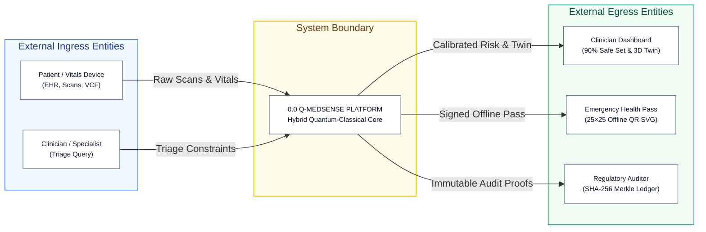
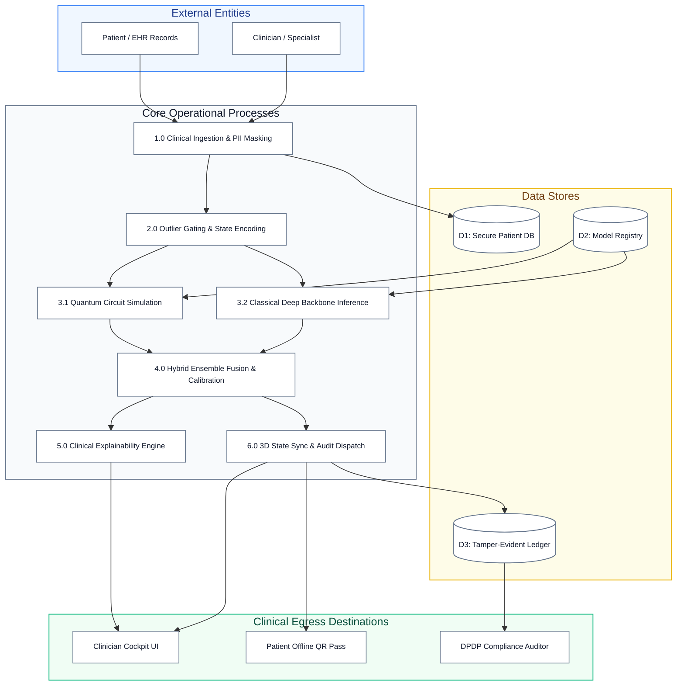

# SLIDE 3: TECHNICAL APPROACH

## Official SIH 2026 Header
- **Problem Statement ID:** `26139`
- **Topic:** `Technical Approach: System Architecture, Data Flow Diagram & Unified Tech Stack`
- **Theme:** `MedTech / BioTech / HealthTech` | **Organization:** `Egreen Quanta`

---

## 1. System Architecture & Technical Data Flow Diagram

The complete end-to-end technical pipeline connects multi-modal clinical data ingestion, mathematical preprocessing, parallel classical and quantum inference, uncertainty quantification, 3D anatomical twin synchronization, and hospital integration.

```mermaid
flowchart TB
    %% =========================================================================
    %% 1. DATA INGESTION & SANITIZATION
    %% =========================================================================
    subgraph S1["1. Data Ingestion & Sanitization"]
        direction TB
        RAW_EHR["EHR / Lab Data<br/>(Lab panels, Vitals, EHR)"]:::cleanNode
        RAW_XRAY["Chest X-Rays<br/>(DICOM / PNG)"]:::cleanNode
        RAW_DERM["Dermoscopy Images<br/>(RGB)"]:::cleanNode
        RAW_VCF["Genomic Files<br/>(VCF 4.2)"]:::cleanNode
        RAW_FHIR["HL7/FHIR Bundles<br/>(Observations)"]:::cleanNode

        PII_ANON["PII De-Identification<br/>SHA-256<br/>Pseudonymization"]:::cleanNode
        OOD_CHECK["Outlier Quality Check<br/>Mahalanobis Distance<br/>(p &lt; 0.01)"]:::cleanNode

        RAW_EHR --> PII_ANON
        RAW_XRAY --> PII_ANON
        RAW_DERM --> PII_ANON
        RAW_VCF --> OOD_CHECK
        RAW_FHIR --> OOD_CHECK
        PII_ANON --> OOD_CHECK
    end

    %% =========================================================================
    %% 2. FEATURE ENGINEERING & ENCODING
    %% =========================================================================
    subgraph S2["2. Feature Engineering & Encoding"]
        direction TB
        TAB_PROC["Tabular Processing<br/>SMOTE-Tomek<br/>Class Balancing<br/>Feature Scaling"]:::cleanNode
        IMG_PROC["Image Processing<br/>Image Normalization<br/>(224 × 224 × 3)<br/>ImageNet Mean/Std"]:::cleanNode

        PCA_NODE["Dimensionality Reduction<br/>PCA (N features → 8 components)"]:::cleanNode

        ANGLE_EMB["Angle Embedding<br/>|ψ(z)⟩ = ⨂ (cos(zᵢ)|0⟩ + sin(zᵢ)|1⟩)"]:::cleanNode
        ZZ_MAP["ZZ-Feature Map<br/>Entanglement via<br/>CNOT + Rz Gates"]:::cleanNode

        TAB_PROC --> PCA_NODE
        IMG_PROC --> PCA_NODE
        PCA_NODE --> ANGLE_EMB
        PCA_NODE --> ZZ_MAP
    end

    %% =========================================================================
    %% 3. HYBRID INFERENCE & ENSEMBLE FUSION
    %% =========================================================================
    subgraph S3["3. Hybrid Inference & Ensemble Fusion"]
        direction TB
        CLASSICAL_MODEL["Classical Deep Learning<br/>DenseNet121 /<br/>DermisNova"]:::cleanNode
        VQC_MODEL["Variational Quantum Classifier<br/>Parameterized Ansatz W(θ)<br/>(2 layers, 8 qubits)"]:::cleanNode

        CLASSICAL_PRED["Classical Predictions<br/>P_classical(y)"]:::cleanNode
        PAULI_MEASURE["Pauli-Z Quantum Measurement<br/>⟨Zᵢ⟩ = ⟨ψ|W†(θ) Zᵢ W(θ)|ψ⟩"]:::cleanNode
        QUANTUM_PRED["Quantum Predictions<br/>P_quantum(y)"]:::cleanNode

        FUSION_ENGINE["Ensemble Fusion Engine<br/>P_hybrid = α P_quantum + (1-α) P_classical"]:::cleanNode
        QAS_SCORE["Quantum Advantage Score<br/>QAS = Accuracy_Q / Accuracy_C"]:::cleanNode

        CLASSICAL_MODEL --> CLASSICAL_PRED
        VQC_MODEL --> PAULI_MEASURE
        PAULI_MEASURE --> QUANTUM_PRED
        CLASSICAL_PRED --> FUSION_ENGINE
        QUANTUM_PRED --> FUSION_ENGINE
        FUSION_ENGINE --> QAS_SCORE
    end

    %% =========================================================================
    %% 4. UNCERTAINTY QUANTIFICATION & EXPLAINABILITY
    %% =========================================================================
    subgraph S4["4. Uncertainty Quantification & Explainability"]
        direction LR
        CONFORMAL_NODE["Conformal Prediction<br/>Guaranteed Coverage<br/>Set C(x) (α = 0.10)"]:::cleanNode
        GRADCAM_NODE["Grad-CAM<br/>Visual Activation<br/>Heatmaps"]:::cleanNode
        SHAP_NODE["SHAP Analysis<br/>Biomarker Attribution<br/>(Shapley Values)"]:::cleanNode
        Q_TELEMETRY["Quantum Telemetry<br/>Parameter-Shift Circuit<br/>Gradients ∂⟨Z⟩/∂θ"]:::cleanNode
    end

    %% =========================================================================
    %% 5. 3D DIGITAL TWIN & REAL-TIME SYNC
    %% =========================================================================
    subgraph S5["5. 3D Digital Twin & Real-Time Sync"]
        direction TB
        ORGAN_MATRIX["Organ Risk Matrix<br/>Cardio, Pulmonary,<br/>Oncology, Metabolic"]:::cleanNode
        VIS_ENGINE["3D Visualization Engine<br/>Three.js WebGL<br/>Vertex Displacement & Glow"]:::cleanNode

        M_HEART["Heart Mesh<br/>(0 - 100%)"]:::cleanNode
        M_LUNGS["Lungs Mesh<br/>(0 - 100%)"]:::cleanNode
        M_SKIN["Skin Mesh<br/>(0 - 100%)"]:::cleanNode
        M_ORGANS["Liver/Kidney/Pancreas<br/>(0 - 100%)"]:::cleanNode
        M_TIME["Risk Timeline<br/>Historical Trend"]:::cleanNode

        ORGAN_MATRIX --> VIS_ENGINE
        VIS_ENGINE --> M_HEART
        VIS_ENGINE --> M_LUNGS
        VIS_ENGINE --> M_SKIN
        VIS_ENGINE --> M_ORGANS
        VIS_ENGINE --> M_TIME
    end

    %% =========================================================================
    %% 6. CLINICAL OUTPUT & INTEGRATION
    %% =========================================================================
    subgraph S6["6. Clinical Output & Integration"]
        direction TB
        REPORT_NODE["Personalized Report<br/>• Risk scores & visualizations<br/>• Model explanations<br/>• Uncertainty estimates<br/>• Recommended next steps"]:::cleanNode
        
        OUT_CLINICIAN["Clinician<br/>(Web Dashboard)"]:::cleanNode
        OUT_EHR["EHR Integration<br/>(FHIR Output)"]:::cleanNode
        OUT_PATIENT["Patient Portal<br/>(Explainable Insights)"]:::cleanNode

        REPORT_NODE --> OUT_CLINICIAN
        REPORT_NODE --> OUT_EHR
        REPORT_NODE --> OUT_PATIENT
    end

    %% =========================================================================
    %% INTER-STAGE DATA FLOWS
    %% =========================================================================
    OOD_CHECK --> TAB_PROC
    OOD_CHECK --> IMG_PROC

    IMG_PROC --> CLASSICAL_MODEL
    ANGLE_EMB --> VQC_MODEL
    ZZ_MAP --> VQC_MODEL

    QAS_SCORE --> CONFORMAL_NODE
    FUSION_ENGINE --> GRADCAM_NODE
    FUSION_ENGINE --> SHAP_NODE
    PAULI_MEASURE --> Q_TELEMETRY

    CONFORMAL_NODE --> ORGAN_MATRIX
    GRADCAM_NODE --> ORGAN_MATRIX
    SHAP_NODE --> ORGAN_MATRIX
    Q_TELEMETRY --> ORGAN_MATRIX

    M_TIME --> REPORT_NODE

    %% =========================================================================
    %% STYLING (Soft Pastel Theme matching reference diagram)
    %% =========================================================================
    classDef cleanNode fill:#FFFFFF,stroke:#64748B,stroke-width:1px,color:#0F172A,font-size:11px;

    style S1 fill:#F0F7FF,stroke:#3B82F6,stroke-width:1.5px,color:#1E3A8A
    style S2 fill:#F0FDF4,stroke:#22C55E,stroke-width:1.5px,color:#14532D
    style S3 fill:#FEFCE8,stroke:#EAB308,stroke-width:1.5px,color:#713F12
    style S4 fill:#FFF1F2,stroke:#F43F5E,stroke-width:1.5px,color:#881337
    style S5 fill:#F5F3FF,stroke:#8B5CF6,stroke-width:1.5px,color:#4C1D95
    style S6 fill:#F0FDF4,stroke:#10B981,stroke-width:1.5px,color:#064E3B
```



---

## 2. Data Flow Diagrams (DFD)

### DFD Level 0: Context Diagram



### DFD Level 1: Process Decomposition Diagram



---

## 3. Unified Technology Stack & Tools Selection (Core Subsystems)

*(Unified into 7 core architectural layers with concise, high-impact rationales)*

| # | LAYER / SUBSYSTEM | TECH STACK & TOOLS | KEY PURPOSE / RATIONALE |
| :-: | :--- | :--- | :--- |
| **01** | **Frontend & 3D Visualization** | **React 18.3, Vite, Tailwind CSS, Three.js WebGL** | Instant triage cockpit, 60 FPS GPU 3D anatomical digital twin, and offline 25×25 QR emergency card. |
| **02** | **Backend & API Gateway** | **FastAPI 0.110+, Uvicorn, Python 3.11+, Pydantic v2** | High-throughput asynchronous routing across 47 validated endpoints with sub-10ms IPC latency. |
| **03** | **Quantum ML Engine** | **PennyLane 0.36+, Qiskit Aer, VQC Circuit** | Parameterized 8-qubit quantum classifier with exact analytic parameter-shift gradients. |
| **04** | **Classical Vision & ML** | **PyTorch 2.2+, DenseNet-121, Scikit-Learn, PCA** | Deep feature extraction from medical scans and orthogonal dimensionality reduction (8–16 PCs). |
| **05** | **Explainability & Uncertainty** | **Kernel SHAP, Grad-CAM, Conformal Prediction (MAPIE)** | Visual saliency heatmaps, biomarker attribution, and mathematically guaranteed 90% confidence sets. |
| **06** | **Data Storage & Privacy** | **SQLite 3 (WAL Mode), AES-256, PyJWT HS256** | Zero-daemon ACID persistence resilient to power loss, with automated HIPAA/DPDP PII stripping. |
| **07** | **Audit Ledger & Deployment** | **SHA-256 Merkle Chain, Docker, Air-Gapped Local Server** | Tamper-evident WORM regulatory audit trail and 100% sovereign on-premise hospital data residency. |

---

## 4. Process of Implementation

1. **Connect with Operational Stakeholders (MoHFW / AIIMS / ICMR):** Evaluate hospital workflow bottlenecks, radiologist backlogs, and fragmented EHR data silos.
2. **Deploy Sovereign Air-Gapped Platform:** Stage Tier 1 Edge on field laptops and Tier 2 Hub on local hospital servers with 100% data residency.
3. **Validate Benchmarks & Governance:** Highlight verified multi-modal benchmarks (89.4% dermoscopy, 91.2% pneumonia), 90% conformal safety sets, and WORM-certified DPDP 2023 compliance.

---

## 5. Working Prototype & Verified Repositories

- **Core GitHub Repository:** [https://github.com/ARYANCY/QDoc](https://github.com/ARYANCY/QDoc)
- **Local Clinical Studio Application:** `http://localhost:5173`
- **Emergency Medical Card App:** `http://localhost:5174`
- **Interactive Swagger API Documentation:** `http://localhost:8000/docs`
- **Automated Verification:** **79/79 Passed Unit and Integration Tests** (`pytest`)

---

## 6. Visual Diagram & Image Generation Specifications

### Heading 1: Q-MedSense System Architecture Diagram
**Visual Diagram Prompt:**
> Detailed multi-tier software system architecture diagram on a dark slate background (`#0A0F1D`). Five clear horizontal layers with a prominent starting badge at the top:
> 0. Starting Point: Clinical Ingestion (EHR Data, Dermoscopy/X-Ray Scans, Lab Vitals).
> 1. Ingestion & Security Boundary (FastAPI Gateway, JWT HS256, PII Stripper).
> 2. Preprocessing & Outlier Gate (Mahalanobis OOD Gate, PCA-8/16, Angle Normalizer).
> 3. Parallel Hybrid ML Engine (PennyLane 8-qubit VQC Circuit alongside PyTorch DenseNet-121).
> 4. Uncertainty & Explainability (Conformal 90% Coverage Set, Kernel SHAP, Grad-CAM).
> 5. Persistence & Delivery (SQLite WAL, AES-256, SHA-256 Merkle Ledger, 25x25 QR Pass, 3D WebGL Twin).
> Clean glowing cyan and cobalt blue bounding boxes, directional data lines, sharp technical typography, vector blueprint style.

**JSON Prompt to Create Image:**
```json
{
  "title": "Q-MedSense System Architecture Diagram",
  "prompt": "Detailed multi-layered software architecture diagram for a medical quantum AI platform. Five cleanly partitioned tiers stacked vertically with a clear starting badge at the top: Starting Point (Clinical Ingestion), Ingestion & Security Layer (FastAPI Uvicorn 127.0.0.1:8000), Mathematical Preprocessing (Mahalanobis OOD, PCA 8-Component Reduction), Parallel Hybrid ML Engine (PennyLane VQC 8-Qubit Circuit and PyTorch DenseNet Backbone), Uncertainty & Explainability (Conformal Coverage, SHAP, Grad-CAM), and Delivery Layer (React 18 Studio, Three.js 3D Twin, SQLite WAL, WORM SHA-256 Ledger). Dark modern tech blueprint theme, cyan and cobalt blue accents, precise engineering layout, crisp typography, 8k resolution.",
  "style": "clean technical architecture blueprint, engineering schematic",
  "aspect_ratio": "16:9",
  "color_palette": ["#0B132B", "#1E293B", "#38BDF8", "#10B981", "#E2E8F0"],
  "composition": "vertical hierarchical layer diagram with prominent top entry point, directional data flow arrows and side callouts",
  "lighting": "subtle glowing edge illumination on tier boundaries",
  "negative_prompt": "hand-drawn, messy wires, overlapping text, cartoon icons, blurry low-res"
}
```

---

### Heading 2: Q-MedSense Level 1 Data Flow Diagram (DFD)
**Visual Diagram Prompt:**
> A clean software engineering Data Flow Diagram (DFD Level 1) on a dark slate background (`#0F172A`):
> - External Entities: Clinician Cockpit UI, Patient Input, Emergency Card.
> - Numbered Circular/Rounded Process Nodes:
>   - 1.0 Data Ingestion & Privacy Masking
>   - 2.0 Dimensionality Reduction & Quantum State Encoding
>   - 3.1 Variational Quantum Circuit Execution
>   - 3.2 Classical Baseline Forward Pass
>   - 4.0 Hybrid Ensemble Fusion & Conformal Calibration
>   - 5.0 Explainability & Attributions (SHAP / Grad-CAM)
>   - 6.0 State Synchronization & WORM Ledger
> - Open Rectangular Data Stores: D1 Secure Patient Store, D2 Model Registry & Checkpoints, D3 WORM Audit Ledger.
> - Clean directional labeled data flow arrows with glowing turquoise and emerald accents.

**JSON Prompt to Create Image:**
```json
{
  "title": "Q-MedSense Level 1 Data Flow Diagram",
  "prompt": "Clean professional software engineering Data Flow Diagram Level 1 (DFD) on dark slate theme (#0F172A). Showing external entities (Clinician, Patient) interacting with numbered circular process nodes: 1.0 Ingestion and De-identification, 2.0 PCA Dimensionality Reduction, 3.1 PennyLane Quantum Circuit Execution, 3.2 Classical Baseline, 4.0 Hybrid Fusion and Conformal Coverage, 5.0 SHAP and Grad-CAM Explainability, and 6.0 WORM Ledger Logging. Connected to open rectangular data store symbols (D1 Patient DB, D2 Model Registry, D3 Audit Ledger) with labeled data flow arrows. Clean cyan and mint green lines, crisp typography, 8k technical diagram.",
  "style": "software engineering data flow diagram, clean vector flowchart",
  "aspect_ratio": "16:9",
  "color_palette": ["#0F172A", "#1E293B", "#00F2FE", "#10B981", "#F8FAFC"],
  "composition": "balanced multi-node process flow diagram with clear input-process-store-output hierarchy",
  "lighting": "subtle glow on process nodes and data pipelines",
  "negative_prompt": "cluttered, blurry lines, illegible text, cartoonish, 3d distortion, low resolution"
}
```
